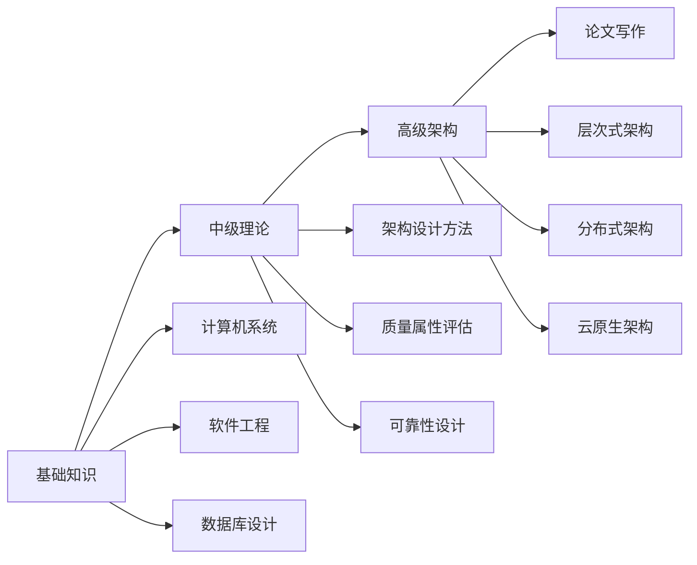

# 软考·高级架构师

!!! abstract "学习指南"
    本专栏整理了软考高级系统架构设计师的核心知识点，涵盖基础知识、中级理论和高级架构三大模块。适合备考考生系统学习，也可作为架构师日常参考手册。

## 考试概述

软考高级架构师是计算机技术与软件专业技术资格（水平）考试的高级职称之一，主要面向系统分析、架构设计和技术管理的高级从业人员。

### 考试科目

| 科目 | 题型 | 满分 | 及格线 | 考查重点 |
|------|------|------|--------|----------|
| **综合知识** | 单选题 | 75 分 | 45 分 | 计算机基础、架构原则、软件工程、数据库、网络等 |
| **案例分析** | 问答题 | 75 分 | 45 分 | 架构设计分析、问题诊断、方案评估 |
| **论文写作** | 写作题 | 75 分 | 45 分 | 结合项目经验，论述架构设计方法论 |

!!! warning "通过标准"
    三科成绩**全部达到 45 分及以上**才算通过，单科不设补考。

### 知识体系

---

## 学习路径

### 第一阶段：基础知识（2-3 周）

夯实计算机专业基础，重点掌握：

- [x] **计算机系统** - 处理器架构、存储体系、指令系统
- [x] **软件工程** - 开发模型、需求分析、设计方法
- [x] **数据库设计** - 关系理论、范式设计、分布式数据库
- [x] **网络基础** - OSI 模型、TCP/IP、网络安全

### 第二阶段：中级理论（2-3 周）

深入理解架构设计核心理论：

- [x] **架构设计方法** - ABSD、视图模型、ADL 语言
- [x] **架构风格** - 管道过滤器、分层、仓库、C2 等
- [x] **质量属性** - 性能、可用性、安全性评估方法
- [x] **架构评估** - ATAM、SAAM 评估方法

### 第三阶段：高级架构（2-3 周）

掌握企业级架构设计实践：

- [x] **层次式架构** - MVC/MVP/MVVM、业务层设计
- [x] **分布式架构** - SOA、微服务、服务网格
- [x] **云原生架构** - 容器化、Kubernetes、Serverless

### 第四阶段：论文写作（1-2 周）

论文写作技巧和模板准备：

- [x] **论文框架** - 摘要、正文、结论模板
- [x] **项目素材** - 准备 2-3 个真实项目案例
- [x] **真题练习** - 历年论文题目模拟

---

## 备考建议

=== "综合知识"

    - 系统学习本专栏基础知识部分
    - 重点关注**标注为重要**的章节
    - 刷历年真题，标记高频考点

=== "案例分析"

    - 掌握架构评估方法（ATAM/SAAM）
    - 熟悉常见架构风格的优缺点
    - 练习图表分析和方案设计

=== "论文写作"

    - 提前准备 2-3 个项目背景
    - 背熟摘要和结论模板
    - 至少完整写 3 篇模拟论文

!!! tip "学习技巧"
    1. **先通读** - 快速浏览全部章节，建立知识框架
    2. **再精读** - 重点攻克标注"重要"的章节
    3. **勤练习** - 结合历年真题巩固知识点
    4. **多总结** - 用思维导图串联知识体系

---

## 相关资源

- 📚 [软考官网](https://www.ruankao.org.cn/) - 报名信息、考试大纲
- 📝 历年真题 - 建议购买近 5 年真题集
- 💬 欢迎在评论区交流学习心得
