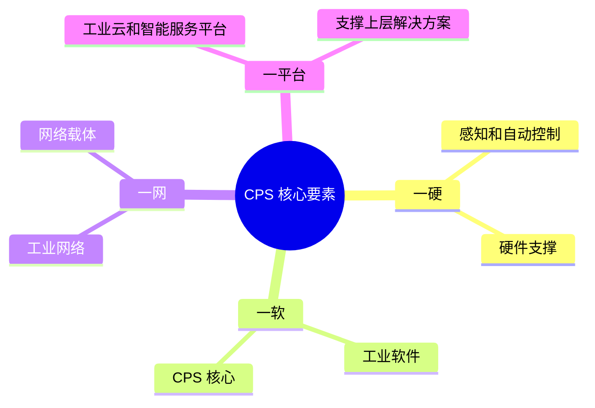
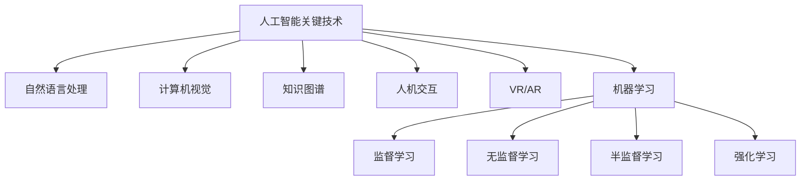
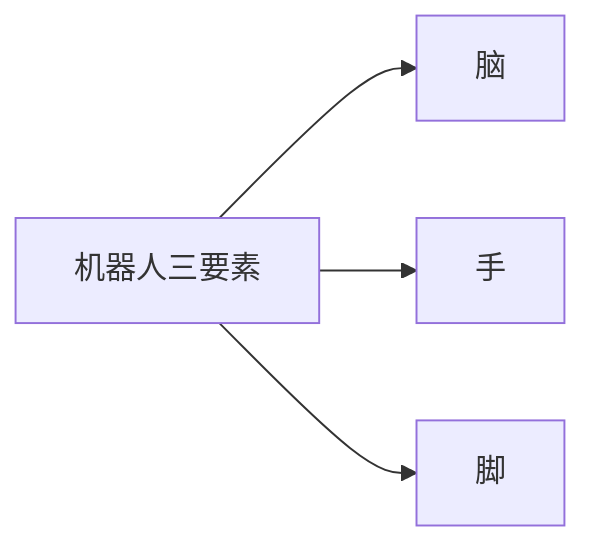
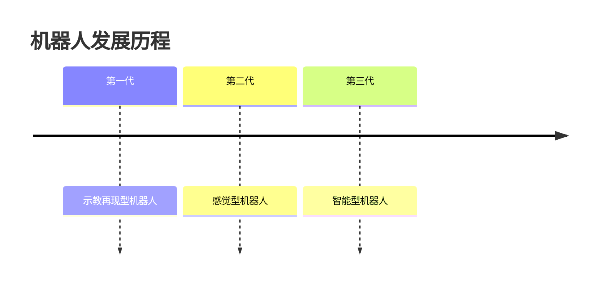
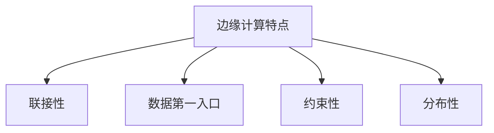
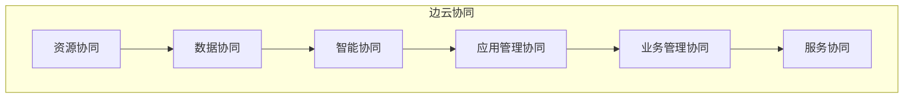
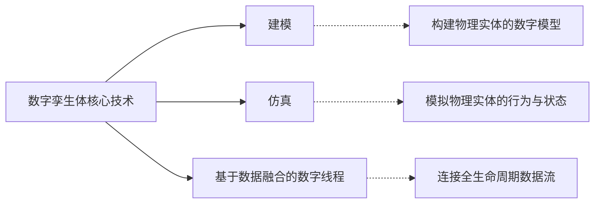
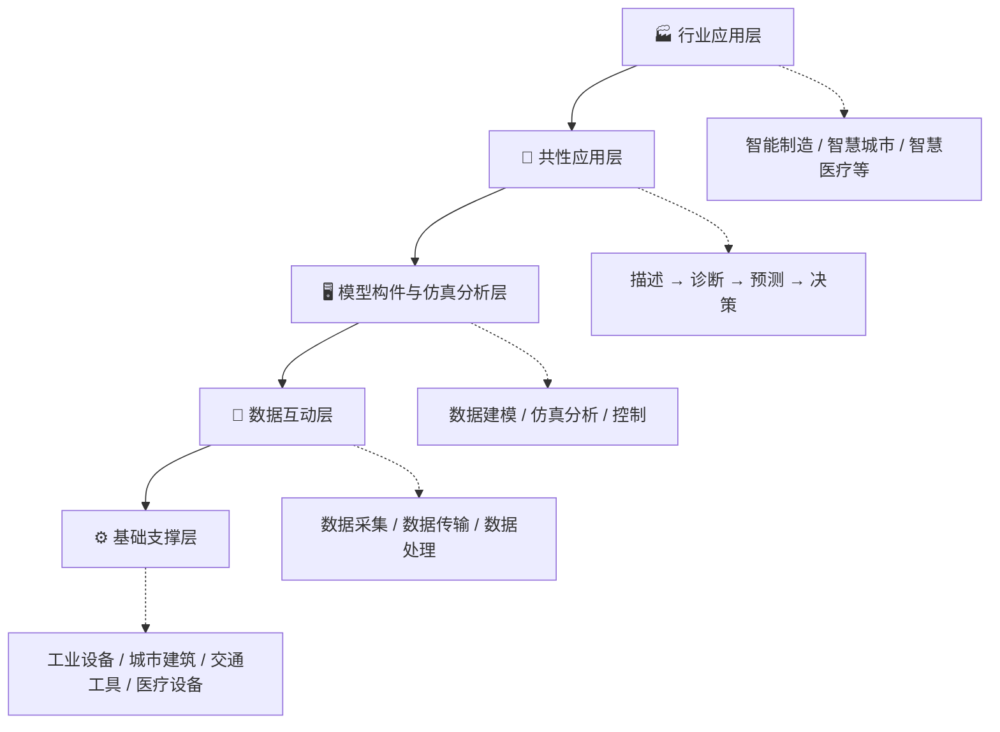
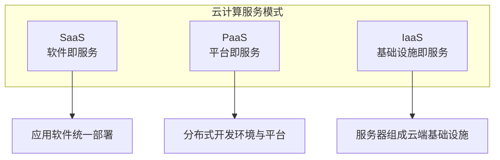
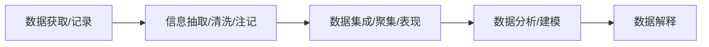

# 未来信息综合

!!! abstract "本章导读"
    本章介绍新兴信息技术的核心概念，包括信息物理系统（CPS）、人工智能、机器人、边缘计算、数字孪生和云计算大数据。这些技术代表了信息技术的发展方向，重点掌握 CPS 四大核心要素、人工智能关键技术、边缘计算特点及边云协同、云计算三种服务模式。

## 学习目标

- [ ] 掌握 CPS 的四大核心技术要素
- [ ] 理解人工智能的定义、分类和关键技术
- [ ] 了解机器人的发展历程和分类
- [ ] 掌握边缘计算的特点和边云协同的六个方面
- [ ] 理解数字孪生体的概念、核心技术和应用
- [ ] 掌握云计算的三种服务模式和四种部署模式

---

## 1. 信息物理系统（CPS）

### 1.1 CPS 概述

**CPS**（Cyber-Physical Systems，信息物理系统）是计算、网络和物理环境的深度融合系统。

### 1.2 四大核心技术要素 ⭐



| 要素 | 名称 | 作用 |
|------|------|------|
| **一硬** | 感知和自动控制 | CPS 实现的 **硬件支撑** |
| **一软** | 工业软件 | CPS 的 **核心** |
| **一网** | 工业网络 | 网络 **载体** |
| **一平台** | 工业云和智能服务平台 | 支撑 **上层解决方案** 的基础 |

!!! tip "记忆技巧"
    **"硬软网平"**：硬件感知 → 软件核心 → 网络载体 → 平台支撑

---

## 2. 人工智能技术

### 2.1 人工智能的定义

!!! quote "人工智能定义"
    人工智能是利用数字计算机或数字计算机控制的机器 **模拟、延伸和扩展人的智能**，感知环境、获取知识并使用知识获得最佳结果的理论、方法、技术及应用系统。

### 2.2 人工智能分类

| 分类 | 特点 |
|------|------|
| **弱人工智能** | 只能在特定领域完成特定任务，不具备真正的推理思考能力 |
| **强人工智能** | 能真正实现推理、思考和解决问题 |

### 2.3 人工智能关键技术 ⭐



| 技术 | 说明 |
|------|------|
| **自然语言处理** | 让计算机理解和生成人类语言 |
| **计算机视觉** | 让计算机理解图像和视频内容 |
| **知识图谱** | 结构化知识的表示和存储 |
| **人机交互** | 人与计算机之间的信息交换方式 |
| **虚拟现实/增强现实** | VR/AR 沉浸式体验技术 |
| **机器学习** | 从数据中学习规律的算法 |

### 2.4 机器学习分类

#### 2.4.1 按学习模式分类

| 模式 | 特点 | 示例 |
|------|------|------|
| **监督学习** | 需要提供 **标注样本集** | 分类、回归 |
| **无监督学习** | **不需要** 提供标注的样本集 | 聚类、降维 |
| **半监督学习** | 需提供 **少量** 标注的样本集 | 部分标注数据的分类 |
| **强化学习** | 需 **反馈机制** | 游戏 AI、机器人控制 |

#### 2.4.2 按学习方法分类

| 方法 | 特点 |
|------|------|
| **传统机器学习** | 需 **手动** 完成特征工程 |
| **深度学习** | 需大量训练数据集和强大 GPU 服务器提供算力，自动学习特征 |

#### 2.4.3 常见算法

| 算法 | 说明 |
|------|------|
| **迁移学习** | 将一个领域学到的知识应用到另一个领域 |
| **主动学习** | 主动选择最有价值的样本进行标注 |
| **演化学习** | 基于生物进化原理的学习算法 |

---

## 3. 机器人技术

### 3.1 机器人定义

机器人具备以下三要素：



传感器类型：

| 传感器类型 | 用途 |
|-----------|------|
| 非接触传感器 | 感知周围环境 |
| 接触传感器 | 感知接触物体 |
| 平衡觉传感器 | 保持平衡 |
| 固定觉传感器 | 位置感知 |

### 3.2 机器人发展历程



### 3.3 机器人 4.0 核心技术

| 技术 | 说明 |
|------|------|
| **云—边—端无缝协同计算** | 云计算、边缘计算、终端协同工作 |
| **持续学习与协同学习** | 不断学习提升，多机器人协作学习 |
| **知识图谱** | 结构化知识表示 |
| **场景自适应** | 自动适应不同使用场景 |
| **数据安全** | 保护机器人数据安全 |

### 3.4 机器人分类

=== "按控制方式分"
    | 类型 | 特点 |
    |------|------|
    | 操作机器人 | 由人直接操控 |
    | 程序机器人 | 按预设程序工作 |
    | 示教再现机器人 | 学习后重复动作 |
    | 智能机器人 | 具有感知和决策能力 |
    | 综合机器人 | 综合多种功能 |

=== "按应用行业分"
    | 类型 | 应用场景 |
    |------|---------|
    | **工业机器人** | 制造业、装配、焊接 |
    | **服务机器人** | 家庭服务、医疗护理 |
    | **特殊领域机器人** | 军事、救援、太空探索 |

---

## 4. 边缘计算

### 4.1 边缘计算定义

!!! quote "边缘计算定义"
    边缘计算是将数据的处理、应用程序的运行以及一些功能服务的实现，由 **网络中心下放到网络边缘节点** 上。

### 4.2 不同组织的定义

| 组织 | 定义要点 |
|------|---------|
| **边缘计算产业联盟** | 云计算在数据中心之外汇聚节点的延伸，包括 **云边缘、边缘云、云化网关** 三类形态 |
| **OpenStack 社区** | 在网络边缘侧提供云服务和 IT 环境服务 |
| **ISO/IEC JTC1/SC38** | 靠近物或数据源头，融合网络、计算、存储、应用核心能力的 **开放平台** |
| **国际标准组织** | 提供移动网络边缘 IT 服务和计算能力，靠近移动用户 |

### 4.3 边缘计算的四大特点 ⭐



| 特点 | 说明 |
|------|------|
| **联接性** | 联接物理对象多样，需具备丰富的联接功能（网络接口、协议等） |
| **数据第一入口** | 拥有大量、实时、完整的数据，支撑预测性维护、资产管理等创新应用 |
| **约束性** | 需适配工业现场恶劣环境，对功耗、成本、空间有较高要求 |
| **分布性** | 天然具备分布式特征，支持分布式计算与存储 |

### 4.4 边云协同 ⭐

边缘计算与云计算协同工作，包括 **六个方面**：



| 协同类型 | 边缘侧职责 | 云侧职责 |
|---------|-----------|---------|
| **资源协同** | 本地资源调度管理 | 资源调度管理策略下发 |
| **数据协同** | 数据采集、初步处理、上传 | 海量数据存储、分析、价值挖掘 |
| **智能协同** | 执行推理，实现分布式智能 | 模型训练，模型下发 |
| **应用管理协同** | 应用部署与运行环境，本地生命周期管理 | 应用开发测试环境，全局生命周期管理 |
| **业务管理协同** | 提供模块化、微服务化的应用实例 | 按需求实现业务编排能力 |
| **服务协同** | 按云端策略实现部分 ECSaaS 服务 | SaaS 服务分布策略，承担云端 SaaS 服务 |

!!! tip "记忆技巧"
    边云协同六个方面可记为：**"资数智应业服"**
    
    - **资** 源协同
    - **数** 据协同
    - **智** 能协同
    - **应** 用管理协同
    - **业** 务管理协同
    - **服** 务协同

### 4.5 边缘计算的安全价值

| 价值 | 说明 |
|------|------|
| 可信基础设施 | 提供可信的基础设施 |
| 可信安全服务 | 为边缘应用提供可信赖的安全服务 |
| 安全网络覆盖 | 提供安全可信的网络和覆盖 |

### 4.6 边缘计算应用场景

| 场景 | 说明 |
|------|------|
| **智慧园区** | 园区智能化管理 |
| **安卓云与云游戏** | 低延迟游戏体验 |
| **视频监控** | 实时视频分析处理 |
| **工业物联网** | 工业数据实时处理 |
| **Cloud VR** | 云端渲染 VR 内容 |

---

## 5. 数字孪生体技术

### 5.1 数字孪生体定义

!!! quote "数字孪生体定义"
    数字孪生体是现有或将有的 **物理实体对象的数字模型**，通过实测、仿真和数据分析来：
    
    - **实时感知**、诊断、预测物理实体对象的状态
    - 通过 **优化和指令** 来调控物理实体对象的行为
    - 通过相关数字模型间的 **相互学习** 来进化自身
    - 同时改进利益相关方在物理实体对象 **生命周期内的决策**

!!! tip "理解要点"
    数字孪生体的本质是 **"虚实映射"**：物理世界的实体在数字世界有一个对应的"镜像"，两者之间实时同步、双向交互。

### 5.2 核心技术 ⭐

数字孪生体依赖三大核心技术支撑：



| 技术 | 作用 | 说明 |
|------|------|------|
| **建模** | 创建物理实体的数字模型 | 是数字孪生体的基础，描述实体的结构与属性 |
| **仿真** | 模拟物理实体的行为 | 在数字空间中预演实体的运行状态与变化 |
| **数字线程** | 基于数据融合，连接全生命周期数据 | 贯穿设计、制造、运维等各阶段的数据通道 |

!!! tip "记忆技巧"
    **"建仿线"**：先 **建** 模型，再 **仿** 真模拟，最后用数字 **线** 程串联全生命周期数据。

### 5.3 主要应用领域

数字孪生体技术已广泛应用于以下四大领域：

| 领域 | 典型应用 | 价值 |
|------|---------|------|
| **制造** | 产品设计、生产优化 | 缩短研发周期，降低试错成本 |
| **产业** | 产业链协同、供应链管理 | 提升协同效率，优化资源配置 |
| **城市** | 智慧城市建设 | 城市规划、应急管理、交通优化 |
| **战场** | 军事仿真、作战推演 | 提升作战决策效率，降低实战风险 |

### 5.4 数字孪生生态系统 ⭐

数字孪生生态系统由下至上分为五个层次，形成完整的技术栈：



| 层次（从下到上） | 组成内容 | 核心职责 |
|----------------|---------|---------|
| **基础支撑层** | 工业设备、城市建筑设备、交通工具、医疗设备 | 提供物理实体，是孪生体的"原型" |
| **数据互动层** | 数据采集、数据传输、数据处理 | 实现物理世界与数字世界的数据流通 |
| **模型构件与仿真分析层** | 数据建模、数据仿真、控制 | 构建数字模型，执行仿真分析 |
| **共性应用层** | **描述、诊断、预测、决策** | 提供通用的四类分析能力 |
| **行业应用层** | 智能制造、智慧城市等多方面应用 | 面向具体行业的落地应用 |

!!! tip "记忆技巧"
    五层结构从下到上可记为：**"基数模共行"**
    
    - **基** 础支撑层（物理实体）
    - **数** 据互动层（数据流通）
    - **模** 型构件与仿真分析层（建模仿真）
    - **共** 性应用层（描述/诊断/预测/决策）
    - **行** 业应用层（具体落地）

!!! note "共性应用层的四个能力"
    共性应用层的 **"描述、诊断、预测、决策"** 是考试高频考点：
    
    | 能力 | 含义 |
    |------|------|
    | **描述** | 实时呈现物理实体的当前状态 |
    | **诊断** | 分析异常原因，定位问题所在 |
    | **预测** | 基于历史数据预判未来趋势 |
    | **决策** | 提供优化建议，支持管理决策 |

---

## 6. 云计算和大数据技术

### 6.1 云计算服务模式 ⭐



| 服务模式 | 全称 | 说明 | 示例 |
|---------|------|------|------|
| **SaaS** | Software as a Service | 服务提供商将应用软件统一部署在云计算服务器上 | Gmail、Salesforce |
| **PaaS** | Platform as a Service | 服务提供商将分布式开发环境与平台作为服务提供 | Google App Engine |
| **IaaS** | Infrastructure as a Service | 服务提供商将服务器组成"云端"基础设施作为计量服务提供 | AWS EC2、阿里云 ECS |

!!! tip "服务模式层次关系"
    ```
    SaaS（应用层）
       ↓ 依赖
    PaaS（平台层）
       ↓ 依赖
    IaaS（基础设施层）
    ```

### 6.2 云计算部署模式

| 部署模式 | 特点 | 适用场景 |
|---------|------|---------|
| **公有云** | 面向公众提供服务 | 通用服务、初创企业 |
| **社区云** | 特定社区共享 | 行业联盟、政府机构 |
| **私有云** | 企业专用 | 大型企业、数据敏感组织 |
| **混合云** | 公有云与私有云结合 | 灵活需求、数据分级管理 |

### 6.3 大数据分析步骤



| 步骤 | 主要任务 |
|------|---------|
| **数据获取/记录** | 收集原始数据 |
| **信息抽取/清洗/注记** | 提取有价值信息，清洗脏数据，添加标注 |
| **数据集成/聚集/表现** | 整合多源数据，聚合分析，可视化展现 |
| **数据分析/建模** | 应用算法分析，建立数据模型 |
| **数据解释** | 解读分析结果，提供决策支持 |

### 6.4 大数据应用领域

| 领域 | 应用场景 |
|------|---------|
| **制造业** | 智能制造、预测性维护、质量控制 |
| **服务业** | 客户分析、精准营销、服务优化 |
| **交通行业** | 智能交通、路线优化、出行预测 |
| **医疗行业** | 精准医疗、疾病预测、药物研发 |

---

## 本章小结

### 核心知识点

1. **CPS 四大要素**：一硬（感知控制）、一软（工业软件）、一网（工业网络）、一平台（工业云）

2. **人工智能关键技术**：自然语言处理、计算机视觉、知识图谱、人机交互、VR/AR、机器学习

3. **机器学习分类**：
   - 按模式：监督、无监督、半监督、强化
   - 按方法：传统机器学习、深度学习

4. **边缘计算特点**：联接性、数据第一入口、约束性、分布性

5. **边云协同六方面**：资源、数据、智能、应用管理、业务管理、服务

6. **数字孪生核心技术**：建模、仿真、数字线程

7. **云计算服务模式**：SaaS、PaaS、IaaS

### 对照表速记

| 技术领域 | 核心要点 |
|---------|---------|
| CPS | 硬软网平 |
| 人工智能 | 6 大关键技术 |
| 机器人 | 三代发展、4.0 技术 |
| 边缘计算 | 4 特点、6 协同 |
| 数字孪生 | 建模仿真线程 |
| 云计算 | SaaS/PaaS/IaaS |

### 考试重点

| 知识点 | 考查形式 |
|-------|---------|
| CPS 四大要素 | 要素名称与作用对应 |
| 机器学习分类 | 根据特点判断学习模式 |
| 边缘计算特点 | 特点识别与理解 |
| 边云协同 | 协同类型及边缘/云端职责 |
| 云计算服务模式 | SaaS/PaaS/IaaS 区分 |

### 学习建议

1. **CPS**：记住"硬软网平"四个要素及其作用
2. **机器学习**：理解四种学习模式的区别和特点
3. **边缘计算**：重点掌握边云协同的六个方面
4. **云计算**：理解三种服务模式的层次关系
