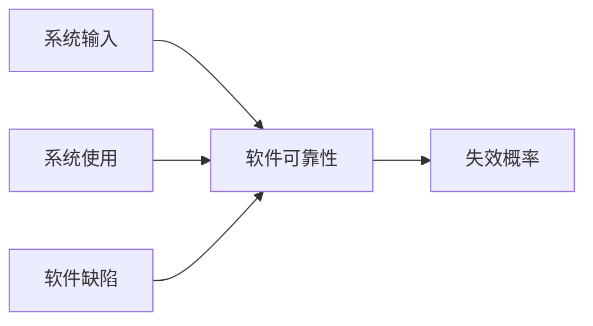
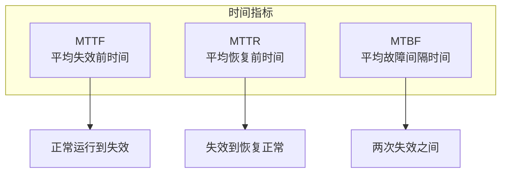
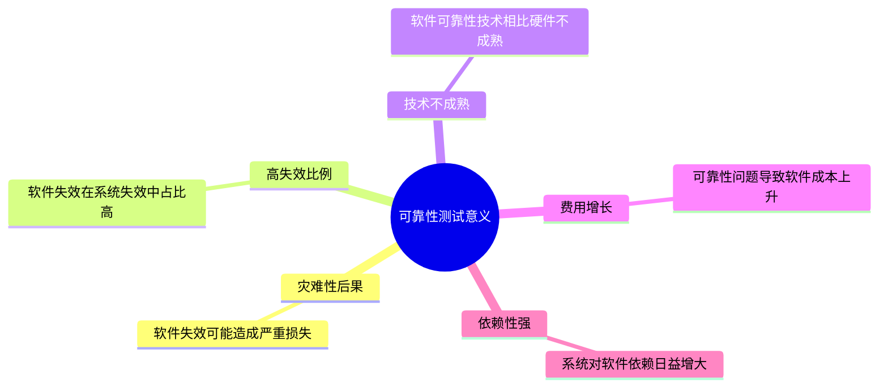
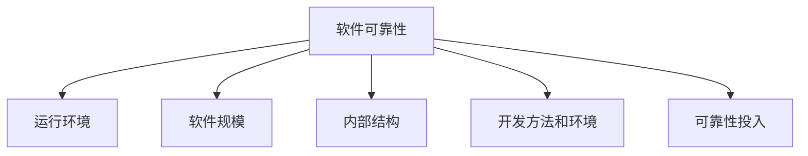
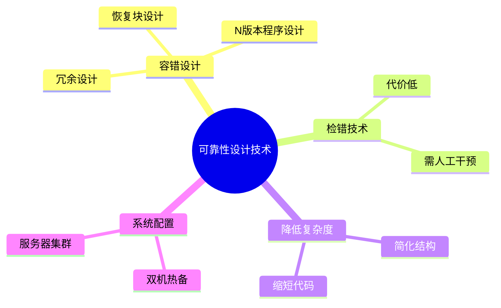
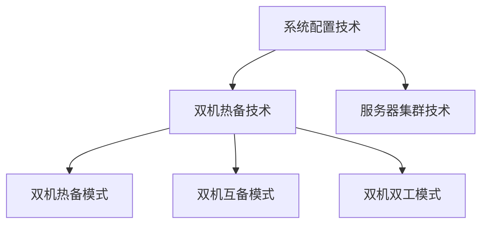
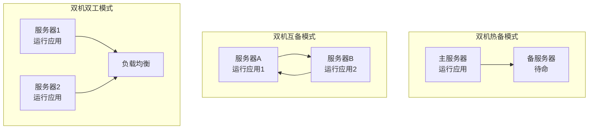

# 软件可靠性基础

!!! abstract "本章导读"
    软件可靠性是衡量软件质量的重要指标，直接关系到系统的稳定运行和用户体验。本章系统介绍软件可靠性的基本概念（MTTF、MTTR、MTBF）、可靠性建模方法、管理流程，重点掌握四种可靠性设计技术（容错、检错、降低复杂度、系统配置）及双机热备的三种工作模式。

## 学习目标

- [ ] 理解软件可靠性的定义和定量描述指标
- [ ] 掌握 MTTF、MTTR、MTBF 三个核心概念及其关系
- [ ] 了解软件可靠性与硬件可靠性的区别
- [ ] 掌握四种可靠性设计技术
- [ ] 熟练掌握双机热备的三种工作模式及其特点
- [ ] 理解可靠性测试和评价的基本流程

---

## 软件可靠性基本概念

### 可靠性的定义

!!! quote "软件可靠性定义"
    软件可靠性是指在**规定的时间内**，软件**不引起系统失效**的概率。该概率是系统输入和系统使用的函数，也是软件中存在的**缺陷函数**。



### 可靠性的定量描述 ⭐

软件可靠性通过以下三个核心指标来定量描述：



| 指标 | 全称 | 含义 | 公式 |
|------|------|------|------|
| **MTTF** | Mean Time To Failure | 平均失效前时间 | 系统正常运行到发生失效的平均时间 |
| **MTTR** | Mean Time To Repair | 平均恢复前时间 | 系统失效到恢复正常的平均时间 |
| **MTBF** | Mean Time Between Failures | 平均故障间隔时间 | 两次相邻失效之间的平均时间 |

!!! tip "关键公式"
    $$MTBF = MTTF + MTTR$$
    
    **可用性** = $\frac{MTTF}{MTBF}$ = $\frac{MTTF}{MTTF + MTTR}$

### 可靠性的目标

软件可靠性目标是用户对软件性能满意程度的期望，可用以下指标描述：

| 描述方式 | 说明 |
|---------|------|
| **可靠度** | 在规定条件下、规定时间内完成规定功能的概率 |
| **平均失效时间** | MTTF |
| **故障强度** | 单位时间内发生故障的次数 |

---

## 可靠性测试

### 测试的意义



### 测试的目的

| 目的 | 说明 |
|------|------|
| 发现软件缺陷 | 找出导致失效的潜在问题 |
| 评估可靠性水平 | 量化软件的可靠性指标 |
| 预测可靠性趋势 | 预测未来一段时间的可靠性水平 |
| 验证可靠性目标 | 确认是否达到预定的可靠性要求 |

### 广义与狭义的可靠性测试

| 类型 | 定义 | 特点 |
|------|------|------|
| **广义** | 为最终评价软件系统的可靠性而运用建模、统计、试验、分析和评价等手段的测试 | 覆盖面广，包含多种方法 |
| **狭义** | 按预先确定好的测试用例，在软件预期使用环境中实施的测试 | 专注于获取可靠性数据 |

---

## 软件可靠性 vs 硬件可靠性

| 比较维度 | 软件可靠性 | 硬件可靠性 |
|---------|-----------|-----------|
| **复杂性** | 复杂性比硬件高，大部分失效来自软件失效 | 相对简单 |
| **物理退化** | 不存在物理退化 | 失效主要由物理退化所致 |
| **唯一性** | 软件是唯一的，每个副本完全一样 | 两个硬件不可能完全一样 |
| **版本更新** | 更新周期快 | 更新周期较慢 |

!!! note "关键区别"
    软件**不会磨损**，但会有**缺陷**；硬件**会磨损**，但出厂时通常**无缺陷**。

---

## 软件可靠性建模

### 影响因素



### 建模方法

| 方法类别 | 具体方法 |
|---------|---------|
| **统计方法** | 种子法、失效率类、曲线拟合类 |
| **增长模型** | 可靠性增长 |
| **结构分析** | 程序结构分析、执行路径分析 |
| **输入分析** | 输入域分类 |
| **数学模型** | 非齐次泊松过程、马尔可夫过程、贝叶斯分析 |

---

## 软件可靠性管理

### 管理阶段


### 需求分析阶段的任务

在需求分析阶段，应完成以下可靠性管理工作：

| 序号 | 任务 |
|:---:|------|
| 1 | 确定软件的可靠性目标 |
| 2 | 分析可能影响可靠性的因素 |
| 3 | 确定可靠性的验收标准 |
| 4 | 制定可靠性管理框架 |
| 5 | 制定可靠性文档编写规范 |
| 6 | 制定可靠性活动初步计划 |
| 7 | 确定可靠性数据收集规范 |

---

## 软件可靠性设计 ⭐

软件可靠性设计包括**四种核心技术**：



### 容错设计技术

容错设计是指系统在出现故障时仍能保持正常运行的能力。

| 技术 | 原理 | 适用场景 |
|------|------|---------|
| **恢复块设计** | 选择一组操作作为容错设计单元，把普通程序块变成恢复块 | 单个模块的容错 |
| **N 版本程序设计** | 设计多个模块或版本，对相同输入进行多数表决 | 关键功能的高可靠性需求 |
| **冗余设计** | 设计不同路径、算法或实现方式的备份模块/系统 | 系统级容错 |

!!! example "N 版本程序设计示例"
    ```mermaid
    graph TB
        A[输入] --> B[版本1]
        A --> C[版本2]
        A --> D[版本3]
        B --> E[表决器]
        C --> E
        D --> E
        E --> F[输出]
    ```
    
    三个版本独立开发，采用不同算法实现相同功能，通过表决器选择多数一致的结果。

### 检错技术

| 要素 | 说明 |
|------|------|
| **检测对象** | 确定需要检测的内容 |
| **检测延时** | 从错误发生到检测出来的时间 |
| **实现方式** | 具体的检测机制 |
| **处理方式** | 检测到错误后的处理方法 |

!!! warning "检错技术特点"
    - **代价低**于容错技术和冗余技术
    - **不能自动解决故障**，需要人工干预

### 降低复杂度设计

设计思想：在保证实现软件功能的基础上：

- 简化软件结构
- 缩短程序代码长度
- 优化软件数据流向
- 降低软件复杂度
- 提高软件可靠性

### 系统配置技术 ⭐

系统配置技术分为两大类：



#### 双机热备技术

采用**"心跳"方法**保证主系统与备用系统的联系。

##### 三种工作模式对比

| 模式 | 工作方式 | 特点 | 适用场景 |
|------|---------|------|---------|
| **双机热备模式** | 一台工作，一台后备 | 资源利用率 50%，切换时间短 | 单一关键应用 |
| **双机互备模式** | 两台运行不同应用，互为后备 | 资源利用率高，对服务器性能要求高 | 多个独立应用 |
| **双机双工模式** | 两台同时运行相同应用 | 负载均衡，高可用 | 高并发、高可用需求 |



!!! tip "双机互备模式详解"
    双机互备模式的关键特点：
    
    1. 两个**相对独立的应用**在两台机器**同时运行**
    2. 彼此均设为**备机**
    3. 当某一台服务器出现故障时，另一台可以在短时间内**接管故障服务器的应用**
    4. 保证了应用的**持续性**
    5. 对服务器**性能要求较高**（需要同时处理自身和备份的应用）

#### 服务器集群技术

集群内各节点服务器通过内部局域网相互通信：

- 若某节点服务器发生故障
- 该服务器运行的应用被另一节点服务器**自动接管**
- 实现高可用性

---

## 软件可靠性测试详解

### 测试组成


### 运行剖面

为软件的使用行为建模，开发使用模型，明确需测试的内容。

### 测试用例设计原则

| 原则 | 说明 |
|------|------|
| 反映实际使用 | 测试用例要能够反映实际的使用情况 |
| 优先级排序 | 优先测试最重要和最频繁使用的功能 |
| 文档记录 | 编写成相关文档 |

### 可靠性数据分类

用时间定义的软件可靠性数据分为 4 类：

| 数据类型 | 说明 |
|---------|------|
| **失效时间数据** | 每次失效发生的具体时间 |
| **失效间隔时间数据** | 相邻两次失效之间的时间间隔 |
| **分组时间内的失效数** | 某时间段内发生的失效次数 |
| **分组时间的累积失效数** | 从开始到某时间点的累计失效次数 |

---

## 软件可靠性评价

### 评价过程


### 模型选择标准

| 标准 | 说明 |
|------|------|
| 假设适用性 | 模型假设是否适合当前软件 |
| 预测能力 | 预测的能力与质量 |
| 输出满足度 | 模型输出值能否满足评价需求 |
| 使用简便性 | 模型使用的简便程度 |

### 数据收集方法

| 方法 | 说明 |
|------|------|
| 尽早确定模型 | 尽可能早地确定可靠性模型 |
| 可操作性计划 | 数据收集计划要有较强的可操作性 |
| 重视数据分析 | 重视测试数据的分析和整理 |
| 利用技术手段 | 充分利用数据库技术完成分析和统计 |

### 评估和预测

| 内容 | 说明 |
|------|------|
| **目的** | 评估软件系统的可靠性状况，预测将来一段时间的可靠性水平 |
| **主要方法** | 软件可靠性模型分析 |
| **辅助方法** | 失效数据的图形分析法、试探性数据分析技术 |

---

## 本章小结

### 核心知识点

1. **三个时间指标**：
   - MTTF（平均失效前时间）
   - MTTR（平均恢复前时间）
   - MTBF = MTTF + MTTR（平均故障间隔时间）

2. **四种设计技术**：
   - 容错设计（恢复块、N 版本、冗余）
   - 检错技术（代价低，需人工干预）
   - 降低复杂度设计
   - 系统配置技术

3. **双机热备三种模式**：
   - 热备模式（主备）
   - 互备模式（互为备份）
   - 双工模式（同时工作）

### 公式速记

$$MTBF = MTTF + MTTR$$

$$可用性 = \frac{MTTF}{MTBF} = \frac{MTTF}{MTTF + MTTR}$$

### 考试重点

| 知识点 | 考查形式 |
|-------|---------|
| MTTF/MTTR/MTBF 概念 | 定义理解、公式计算 |
| 双机热备三种模式 | 根据场景判断模式类型 |
| 容错设计技术 | N 版本程序设计原理 |
| 软件 vs 硬件可靠性 | 区别对比 |

### 学习建议

1. **时间指标**：牢记公式和概念，能进行简单计算
2. **双机热备**：理解三种模式的区别，能根据场景判断
3. **设计技术**：重点理解容错设计的三种方法
4. **对比记忆**：软件与硬件可靠性的四个主要区别
