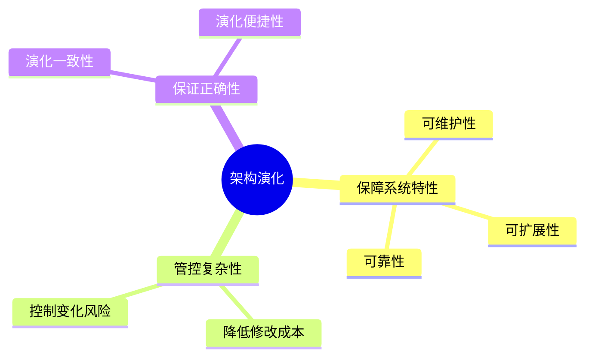
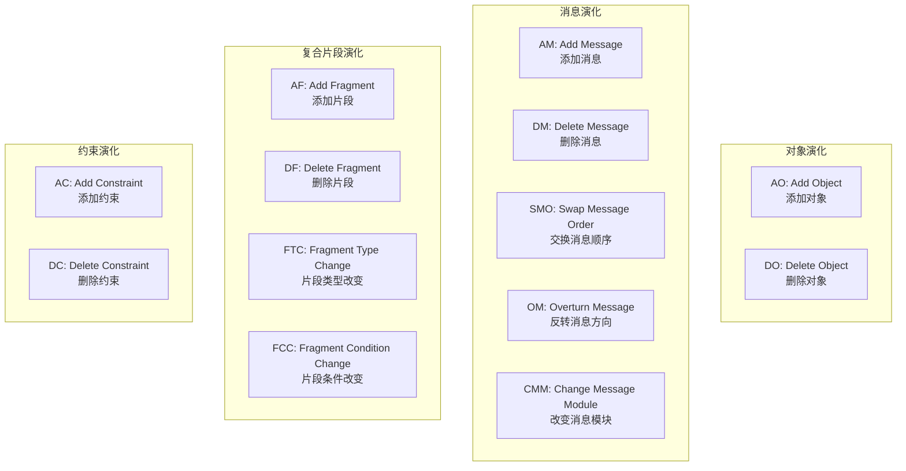
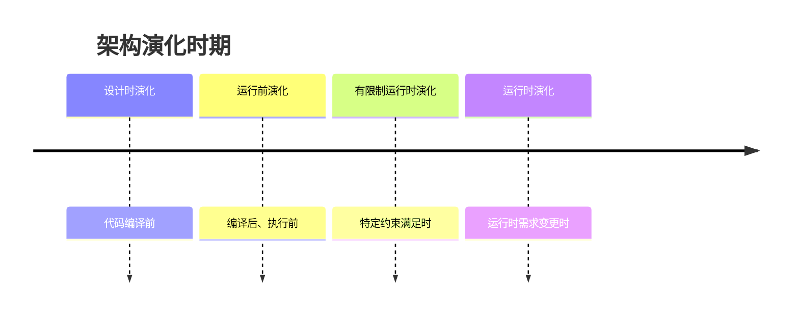
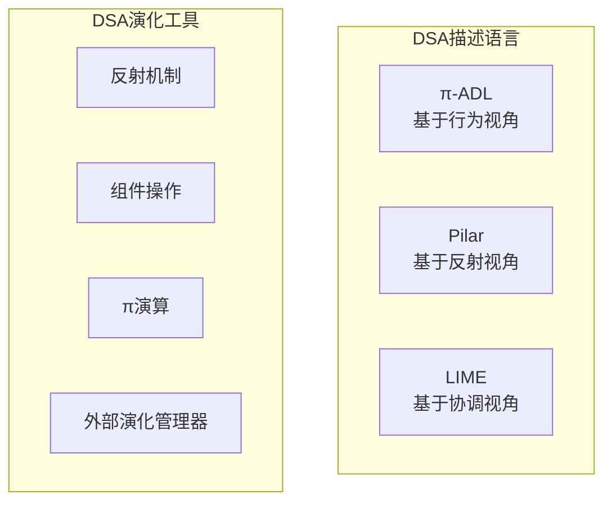
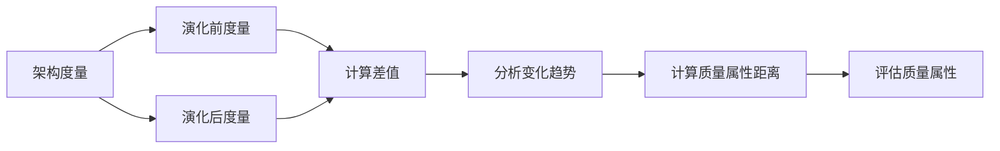
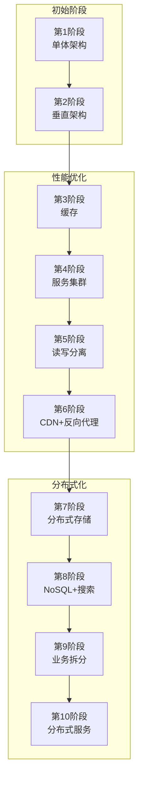
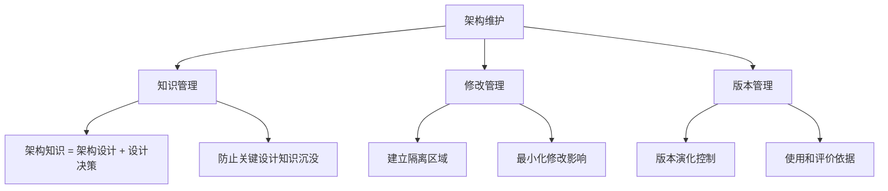
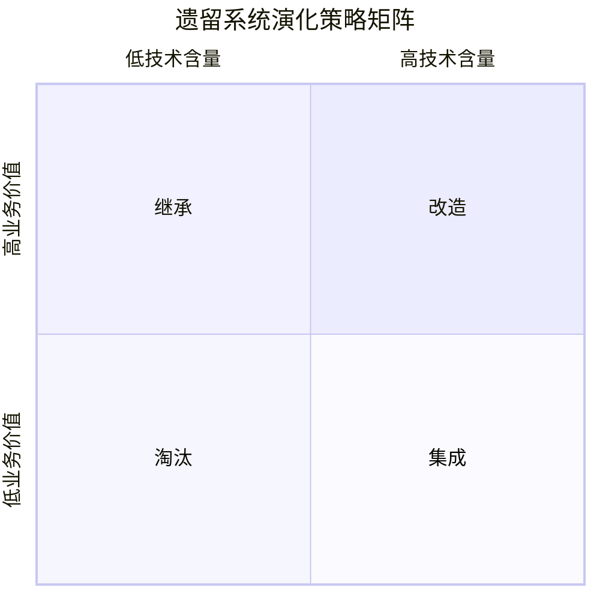

# 软件架构演化和维护

!!! abstract "本章导读"
    软件架构演化是保障系统持续满足业务需求的关键活动。本章介绍面向对象架构演化的四种类型（对象、消息、复合片段、约束）、静态与动态演化的区别、18 种演化原则，以及大型网站架构演化的典型路径。重点理解遗留系统的四种演化策略（淘汰、继承、改造、集成）及其适用场景。

## 学习目标

- [ ] 理解软件架构演化与架构定义的关系
- [ ] 掌握面向对象软件架构演化的四种类型及其操作
- [ ] 区分静态演化和动态演化的特点与应用场景
- [ ] 熟记 18 种架构演化原则
- [ ] 掌握遗留系统的四种演化策略及判断标准
- [ ] 理解大型网站架构演化的典型阶段

---

## 软件架构演化概述

### 演化的重要性

软件架构演化对系统健康发展至关重要：

### 演化与定义的关系

软件架构包括**组件、连接件和约束**三大要素，因此架构演化主要关注这三个要素的：

| 操作类型 | 说明 |
|---------|------|
| **添加** | 引入新的组件、连接件或约束 |
| **修改** | 调整现有元素的属性或行为 |
| **删除** | 移除不再需要的元素 |

---

## 面向对象软件架构演化

面向对象架构演化涉及四个维度：**对象演化、消息演化、复合片段演化、约束演化**。

### 演化类型总览

### 对象演化

对象演化影响架构设计的动态行为：

| 操作 | 全称 | 触发场景 |
|------|------|---------|
| **AO** | Add Object | 需要添加新功能，或将现有功能独立以增加架构灵活性 |
| **DO** | Delete Object | 需要移除某功能，或合并对象以降低架构复杂度 |

### 消息演化

消息演化涉及对象间的交互行为变更：

| 操作 | 全称 | 触发场景 |
|------|------|---------|
| **AM** | Add Message | 对象间需要增加新的交互行为 |
| **DM** | Delete Message | 需要移除某个交互行为 |
| **SMO** | Swap Message Order | 需要改变两个交互行为的执行顺序 |
| **OM** | Overturn Message | 需要反转消息的发送者与接收者 |
| **CMM** | Change Message Module | 需要改变消息的发送或接收对象 |

!!! tip "记忆技巧"
    消息演化 5 种操作可记为：**"增删换反改"**
    
    - **增**：AM（增加消息）
    - **删**：DM（删除消息）
    - **换**：SMO（交换顺序）
    - **反**：OM（反转方向）
    - **改**：CMM（改变模块）

### 复合片段演化

复合片段演化涉及控制流的变更：

| 操作 | 全称 | 触发场景 |
|------|------|---------|
| **AF** | Add Fragment | 需要增添新的控制流 |
| **DF** | Delete Fragment | 需要移除当前某段控制流 |
| **FTC** | Fragment Type Change | 需要改变控制流的类型 |
| **FCC** | Fragment Condition Change | 需要改变控制流的执行条件 |

### 约束演化

| 操作 | 全称 | 说明 |
|------|------|------|
| **AC** | Add Constraint | 添加新约束，需判断当前设计是否满足新约束 |
| **DC** | Delete Constraint | 移除不必要的约束条件 |

---

## 软件架构演化方式分类

### 按演化时期分类

| 演化时期 | 发生时机 | 特点 |
|---------|---------|------|
| **设计时演化** | 架构模型与代码编译之前 | 最灵活、成本最低 |
| **运行前演化** | 编译之后、执行之前 | 需重新部署 |
| **有限制运行时演化** | 特定约束满足时 | 有条件的动态调整 |
| **运行时演化** | 系统运行中 | 最复杂、风险最高 |

### 静态演化

**静态演化需求**：设计时演化需求 + 运行前演化需求

**静态演化的一般过程**：

**静态演化的原子操作**：

=== "可维护性相关"
    | 操作 | 全称 | 说明 |
    |------|------|------|
    | AMD | Add Module Dependence | 添加模块依赖 |
    | RMD | Remove Module Dependence | 移除模块依赖 |
    | AMI | Add Module Interface | 添加模块接口 |
    | RMI | Remove Module Interface | 移除模块接口 |
    | AM | Add Module | 添加模块 |
    | RM | Remove Module | 移除模块 |
    | SM | Split Module | 拆分模块 |
    | AGM | Aggregate Modules | 聚合模块 |

=== "可靠性相关"
    | 操作 | 全称 | 说明 |
    |------|------|------|
    | AMS | Add Message | 添加消息 |
    | RMS | Remove Message | 移除消息 |
    | AO/RO | Add/Remove Object | 添加/移除对象 |
    | AF/RF | Add/Remove Fragment | 添加/移除片段 |
    | CF | Change Fragment | 改变片段 |
    | AU/RU | Add/Remove Use Case | 添加/移除用例 |
    | AA/RA | Add/Remove Actor | 添加/移除参与者 |

### 动态演化

**动态演化需求**：

- 软件内部执行导致的架构改变
- 软件系统外部请求的重配置

**动态演化类型**：

| 分类维度 | 类型 |
|---------|------|
| **动态性等级** | 交互动态性 → 结构动态性 → 架构动态性 |
| **演化内容** | 属性改名、行为变化、拓扑结构改变、风格变化 |

**动态软件架构（DSA）**：

**动态重配置模式**：

| 模式 | 特点 |
|------|------|
| 主从模式 | 主节点控制从节点的配置 |
| 中央控制模式 | 统一的控制中心管理所有配置 |
| 客户端/服务器模式 | C/S 架构下的配置管理 |
| 分布式控制模式 | 去中心化的配置协调 |

!!! warning "动态配置难点"
    - 约束定义困难
    - 性能约束难以静态衡量
    - 难以管理所有方面
    - 需同时保证组件系统完整性和重配置策略的正确安全性

---

## 软件架构演化原则

软件架构包括 **18 种可持续演化原则**，可分为五大类：

### 成本与风险控制

| 序号 | 原则 | 说明 |
|:---:|------|------|
| 1 | **演化成本控制原则** | 演化成本要控制在预期范围内 |
| 2 | **进度可控原则** | 架构演化要在预期时间内完成 |
| 3 | **风险可控原则** | 经济、时间、人力、技术、环境风险在可控范围内 |

### 系统稳定性

| 序号 | 原则 | 说明 |
|:---:|------|------|
| 4 | **主体维持原则** | 平均增量增长保持平稳，保证系统主体行为稳定 |
| 5 | **系统总体结构优化原则** | 使演化后系统整体结构（布局）更加合理 |
| 6 | **平滑演化原则** | 软件的演化速率趋于稳定 |
| 7 | **目标一致原则** | 架构演化的阶段目标和最终目标要一致 |

### 模块独立性

| 序号 | 原则 | 说明 |
|:---:|------|------|
| 8 | **模块独立演化原则** | 软件中各模块自身的演化最好相互独立 |
| 9 | **影响可控原则** | 一个模块变更对其他模块的影响在可控范围内 |
| 10 | **复杂性可控原则** | 控制架构复杂性，保障软件复杂性在可控范围内 |

### 可重构与可重用

| 序号 | 原则 | 说明 |
|:---:|------|------|
| 11 | **有利于重构原则** | 使演化后软件架构便于重构 |
| 12 | **有利于重用原则** | 演化最好能维持甚至提高整体架构的可重用性 |
| 13 | **设计原则遵循性原则** | 架构演化不能与架构设计原则冲突 |

### 环境适应性

| 序号 | 原则 | 说明 |
|:---:|------|------|
| 14 | **适应新技术原则** | 软件独立于特定技术手段，可运行于不同平台 |
| 15 | **环境适应性原则** | 演化后的软件版本容易适应新的硬件和软件环境 |
| 16 | **标准依从性原则** | 演化不违背相关质量标准（国际、国家、行业） |
| 17 | **质量向好原则** | 使所关注的质量指标或综合效果变更好 |
| 18 | **适应新需求原则** | 很容易适应新的需求变更 |

!!! tip "记忆技巧：18 原则分类记忆"
    - **成本风险**（3）：成本、进度、风险
    - **系统稳定**（4）：主体、结构、平滑、目标
    - **模块独立**（3）：独立、影响、复杂
    - **重构重用**（3）：重构、重用、设计
    - **环境适应**（5）：技术、环境、标准、质量、需求

---

## 软件架构演化评估

### 演化过程已知的评估

### 演化过程未知的评估

当演化过程未知时，需要通过架构逆向工程等手段重建架构信息，然后进行评估。

---

## 大型网站系统架构演化实例

大型网站架构演化通常经历以下 **10 个阶段**：

| 阶段 | 架构模式 | 核心特点 |
|:---:|---------|---------|
| 1 | **单体架构** | 应用、数据库、文件都在一台服务器上 |
| 2 | **垂直架构** | 应用和数据分离（应用服务器、文件服务器、数据服务器） |
| 3 | **使用缓存** | 本地缓存 + 分布式缓存服务器 |
| 4 | **服务集群** | 负载均衡调度服务器，解决高并发问题 |
| 5 | **读写分离** | 主数据库写、从数据库读，主从复制同步 |
| 6 | **CDN + 反向代理** | CDN 就近获取，反向代理缓存静态资源 |
| 7 | **分布式存储** | 业务分库，不同业务数据部署在不同服务器 |
| 8 | **NoSQL + 搜索引擎** | 引入 NoSQL 和搜索引擎提升查询能力 |
| 9 | **业务拆分** | 将网站拆分成多个独立应用，独立部署 |
| 10 | **分布式服务** | 微服务化，服务间通过 RPC 通信 |

---

## 软件架构维护

软件架构维护包括三个核心管理活动：

### 架构可维护性度量指标

| 指标 | 全称 | 说明 |
|------|------|------|
| **CNN** | 圈复杂度 | 衡量程序逻辑复杂度 |
| **FFC** | 扇入扇出度 | 衡量模块调用关系 |
| **CBO** | 模块间耦合度 | 衡量模块间依赖程度 |
| **RFC** | 模块的响应 | 衡量模块响应能力 |
| **TCC** | 紧内聚度 | 衡量模块内部紧密程度 |
| **LCC** | 松内聚度 | 衡量模块内部松散程度 |

---

## 遗留系统演化策略 ⭐

!!! warning "高频考点"
    遗留系统演化策略是考试重点，需要根据**技术含量**和**业务价值**两个维度判断采用哪种策略。

### 四种演化策略

| 策略 | 技术含量 | 业务价值 | 适用场景 | 关键措施 |
|------|:-------:|:-------:|---------|---------|
| **淘汰** | 低 | 低 | 技术落后且业务价值低 | 全面重新开发新系统 |
| **继承** | 低 | 高 | 技术落后但业务依赖强 | 完全兼容功能模型和数据模型，新老并行运行 |
| **改造** | 高 | 高 | 技术先进且业务价值高 | 系统功能增强 + 数据模型改造 |
| **集成** | 高 | 低 | 技术先进但形成信息孤岛 | 打通不同平台和数据模型，消除信息孤岛 |

### 详细说明

=== "淘汰策略"
    **适用条件**：技术含量低 + 业务价值低
    
    **措施**：全面重新开发新系统以代替遗留系统
    
    **特点**：彻底替换，不保留原有系统

=== "继承策略"
    **适用条件**：技术含量低 + 业务价值高
    
    **措施**：
    
    - 完全兼容遗留系统的**功能模型**和**数据模型**
    - 新老系统**并行运行**一段时间
    - 保证业务连续性
    
    **特点**：平稳过渡，保障业务不中断

=== "改造策略"
    **适用条件**：技术含量高 + 业务价值高
    
    **措施**：
    
    - **系统功能的增强**
    - **数据模型的改造**
    
    **特点**：保留技术优势，提升业务能力

=== "集成策略"
    **适用条件**：技术含量高 + 业务价值低（局部）
    
    **典型场景**：
    
    - 系统只完成某个部门的业务管理
    - 多个系统基于不同平台、不同数据模型
    - 形成多个"信息孤岛"
    
    **措施**：整合各系统，消除信息孤岛
    
    **特点**：统一平台，数据互通

---

## 系统维护类型

系统维护是系统交付使用后的改变工作，根据维护原因分为四种类型：

| 维护类型 | 别称 | 触发原因 | 说明 |
|---------|------|---------|------|
| **正确性维护** | 改正性维护 | 发现缺陷 | 改正开发阶段已发生但测试未发现的错误 |
| **适应性维护** | - | 环境变化 | 适应硬件、软件配置或数据环境的变化 |
| **完善性维护** | - | 新需求 | 扩充功能、增强性能、改进加工效率、提高可维护性 |
| **预防性维护** | - | 未来变化 | 主动增加新功能以适应未来软硬件环境变化 |

!!! tip "记忆技巧"
    四种维护类型可记为：**"正适完预"**
    
    - **正**确性：改 Bug
    - **适**应性：适应环境
    - **完**善性：加功能
    - **预**防性：防未来

---

## 本章小结

### 核心知识点

1. **面向对象演化**：对象（2）、消息（5）、复合片段（4）、约束（2）共 13 种操作
2. **演化方式**：静态演化（设计时、运行前）vs 动态演化（运行时）
3. **演化原则**：18 种原则分五大类（成本风险、系统稳定、模块独立、重构重用、环境适应）
4. **大型网站演化**：10 个阶段（单体→垂直→缓存→集群→读写分离→CDN→分布式→NoSQL→拆分→微服务）
5. **遗留系统策略**：淘汰（低低）、继承（低高）、改造（高高）、集成（高低）
6. **系统维护**：正确性、适应性、完善性、预防性

### 考试重点

| 知识点 | 考查形式 |
|-------|---------|
| 遗留系统演化策略 | 根据技术含量和业务价值判断策略类型 |
| 演化操作类型 | 识别各种演化操作的触发场景 |
| 维护类型区分 | 根据维护原因判断维护类型 |
| 演化原则 | 理解各原则的含义和应用 |

### 学习建议

1. **遗留系统策略**：画出四象限图，牢记各象限对应的策略
2. **演化操作**：理解每种操作的含义，能举出实际例子
3. **维护类型**：通过典型场景区分四种维护类型
