# 系统架构设计

!!! abstract "本章导读"

    系统架构设计是架构师考试的核心章节，涵盖架构风格、ABSD 方法、DSSA 和中间件等关键内容。本章将系统讲解软件架构的定义、设计方法、常见风格及其应用场景，帮助你建立完整的架构设计知识体系。

## 学习目标

通过本章学习，你应该能够：

- [x] 理解软件架构的定义和在生命周期各阶段的作用
- [x] 掌握基于架构的软件开发方法（ABSD）
- [x] 熟练掌握各种软件架构风格及其特点
- [x] 理解特定领域软件架构（DSSA）的概念
- [x] 了解中间件技术和典型应用架构

---

## 软件架构基础

### 架构的定义

**软件架构**（Software Architecture）是指系统的一个或多个结构，包括：

- 软件的 ==构件==（程序模块、类、中间件等）
- 构件的 ==外部可见属性==
- 构件之间的 ==相互关系==

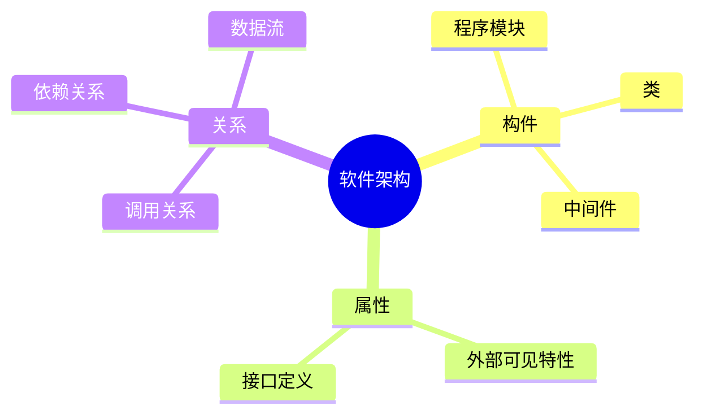

### 架构与生命周期

软件架构贯穿整个软件生命周期，各阶段的作用不同：

| 阶段 | 架构工作重点 | 作用 |
|-----|------------|------|
| **需求分析** | 需求到架构的转换 | 便于各方交流，保持可追踪性 |
| **设计阶段** | 架构模型描述、分析 | ==关注最早最多== 的阶段 |
| **实现阶段** | 架构到代码的转换 | 指导编码实现 |
| **构件组装** | 可复用构件集成 | 提高系统实现效率 |
| **部署阶段** | 部署方案设计与评估 | 组织硬件架构 |
| **后开发** | 维护、演化、复用 | 支持系统演进 |

### 架构描述语言（ADL）

!!! warning "考点提示"

    ADL 与其他建模语言的最大区别是：更关注 ==连接件==（构件间的互联机制）。

ADL 的主要组成部分：

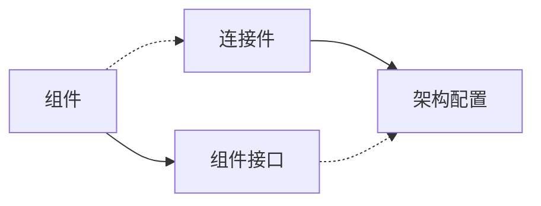

典型的 ADL 语言：Unicon、Rapide、Darwin、Wright、C2SADL、Acme 等。

---

## 基于架构的软件开发方法（ABSD）

### ABSD 核心概念

ABSD 是体系结构 ==驱动== 的设计方法，驱动因素包括：

- **商业需求**
- **质量需求**
- **功能需求**

!!! tip "ABSD 三个基础"

    1. **功能分解**：将系统功能逐层分解
    2. **架构风格选择**：实现质量和商业需求
    3. **软件模板使用**：提高开发效率

### ABSD 描述方式

| 描述内容 | 描述方式 |
|---------|---------|
| 软件架构 | ==视角与视图== |
| 功能需求 | ==用例== |
| 质量需求 | ==质量场景== |

### 基于架构的开发模型

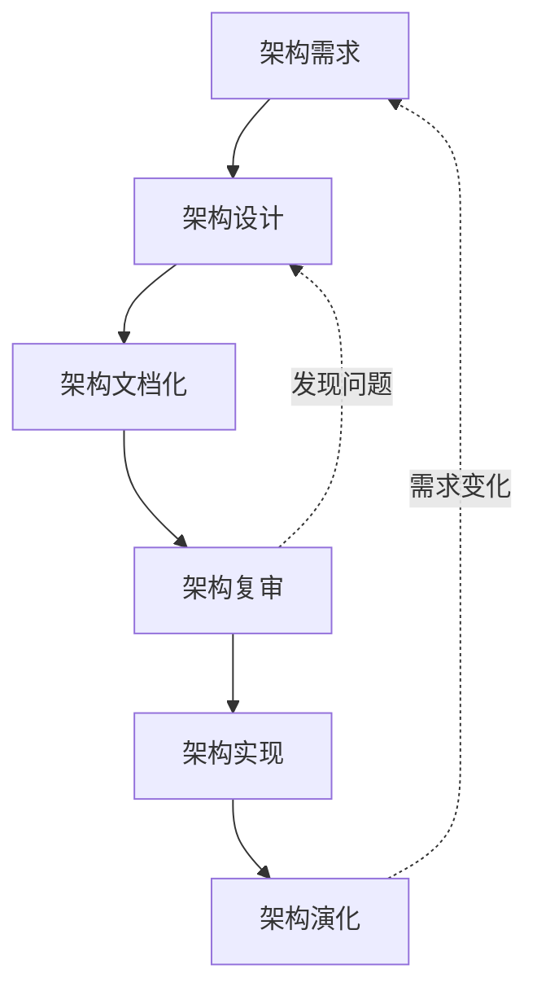

#### 六个子过程详解

=== "1. 架构需求"

    **主要工作**：获取用户需求、标识系统构件
    
    **构件标识步骤**：
    
    1. 生成类图
    2. 对类进行分组
    3. 把类打包成构件

=== "2. 架构设计"

    **设计过程**：
    
    ```
    提出架构模型 → 映射构件 → 分析构件交互 → 设计评审
    ```
    
    !!! warning "重要"
        设计评审 ==必须邀请独立于系统开发的外部人员==

=== "3. 架构文档化"

    **主要输出**：
    
    - 体系结构规格说明
    - 测试体系结构需求的质量设计说明书
    
    **编写原则**：
    
    - 从 ==使用者== 角度编写
    - 分发给所有相关开发人员
    - 保持即时更新，但不过于频繁
    - 避免不必要的重复

=== "4. 架构复审"

    **参与人员**：外部人员（用户代表、领域专家）
    
    **目的**：==标识潜在风险==，及早发现设计缺陷

=== "5. 架构实现"

    **实现流程**：
    ```
    分析与设计 → 构件实现 → 构件组装 → 系统测试
    ```

=== "6. 架构演化"

    **演化步骤**：
    ```
    需求变化归类 → 演化计划 → 构件变动 → 更新交互 → 组装测试 → 技术评审 → 演化后架构
    ```

---

## 软件架构风格

!!! warning "核心考点"

    架构风格是考试的重点，需要掌握每种风格的特点、优缺点和适用场景。

### 架构风格概述

软件架构风格定义了：

- **词汇表**：包含构件和连接件
- **约束**：定义构件和连接件的组合方式

### 风格分类总览

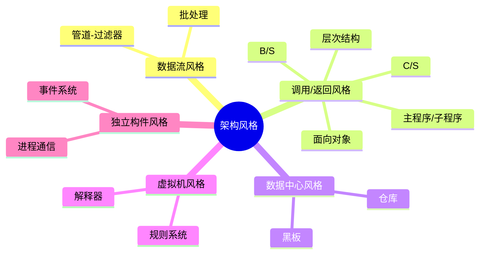

### 数据流风格

#### 管道-过滤器风格

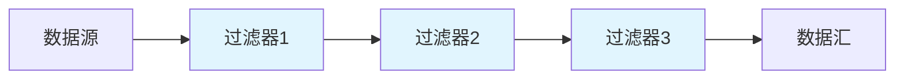

| 优点 | 缺点 |
|-----|------|
| 高内聚、低耦合 | 数据传输需统一标准 |
| 支持复用 | 难以支持事件交互 |
| 易于并发/顺序实现 | |
| 可扩展、灵活 | |

!!! tip "典型应用"

    Linux/Unix Shell、传统编译器

#### 批处理 vs 管道-过滤器

| 特性 | 批处理 | 管道-过滤器 |
|-----|-------|-----------|
| 数据传递 | ==整体== 传递 | ==增量== 传递 |
| 执行顺序 | 必须顺序执行 | 可并发执行 |
| 步骤依赖 | 前一步必须完成 | 可流式处理 |

### 调用/返回风格

#### 层次型架构

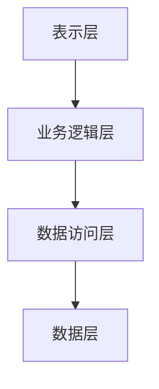

!!! warning "性能问题"

    层次越多，中间调用越多，==性能越差==

#### C/S 架构

=== "二层 C/S"

    | 组成 | 功能 |
    |-----|------|
    | 客户端 | 用户交互 |
    | 服务器 | 数据管理 |
    
    **缺点**：开发成本高、维护升级困难、移植困难

=== "三层 C/S"

    ```mermaid
    graph LR
        A[表示层<br>用户界面] --> B[功能层<br>业务逻辑]
        B --> C[数据层<br>数据管理]
    ```
    
    ==瘦客户端模式==，更易于维护和扩展

#### B/S 架构

三层结构：浏览器 → Web 服务器 → 数据库服务器

| 与 C/S 相比的不足 |
|-----------------|
| 动态页面支持能力弱 |
| 系统扩展能力差 |
| 安全性难以控制 |
| 响应速度不足 |
| 数据交互性不强 |

### 数据中心风格

#### 仓库风格

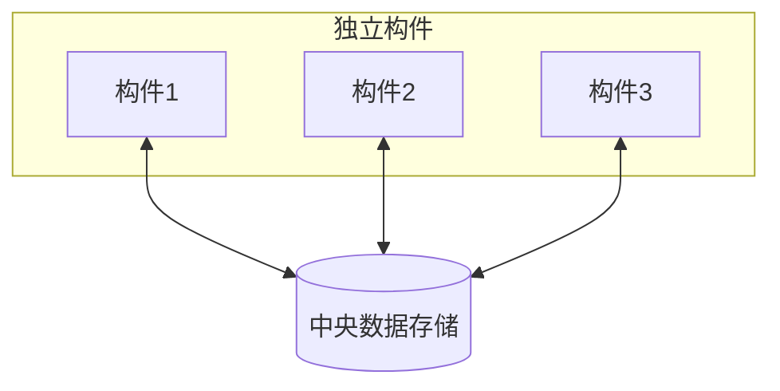

#### 黑板风格

!!! info "特点"

    - 由 ==中央数据当前状态== 触发进程执行
    - 适用于不确定性问题求解
    - 典型应用：语音识别、模式识别、机器翻译

| 优点 | 缺点 |
|-----|------|
| 便于数据共享 | 需达成数据结构一致 |
| 可修改、可维护 | 需同步和锁机制 |
| 支持容错 | 测试困难 |
| 可重用知识源 | 效率低、成本高 |

### 虚拟机风格

#### 解释器风格

!!! tip "核心思想"

    人为构建运行环境，解析与运行自定义语言，增加架构灵活性。

**典型应用**：Java 虚拟机、专家系统

| 优点 | 缺点 |
|-----|------|
| 平台无关 | 执行效率低 |
| 灵活性高 | |

!!! tip "性能优化"

    可通过 ==预编译部分解释代码== 提高性能

#### 规则系统风格

组成：知识库 + 规则解释器 + 规则/数据选择器 + 工作内存

### 独立构件风格

#### 事件系统（隐式调用）风格

!!! info "特点"

    构件不直接调用过程，而是 ==触发或广播事件==

**典型应用**：Windows 图形界面、调试器断点机制

!!! tip "性能优化"

    可通过 ==处理函数并发调用== 提高性能

### C2 风格

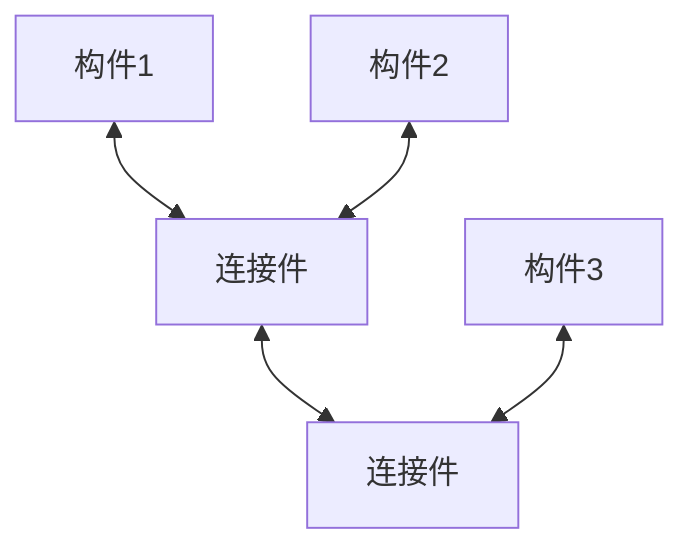

**特点**：构件通过连接件连接，==构件与构件之间无直接连接==

---

## 特定领域软件架构（DSSA）

### DSSA 概念

DSSA 是在 ==特定领域== 中为一组应用提供组织结构参考的 ==标准软件体系结构==。

**四大特征**：

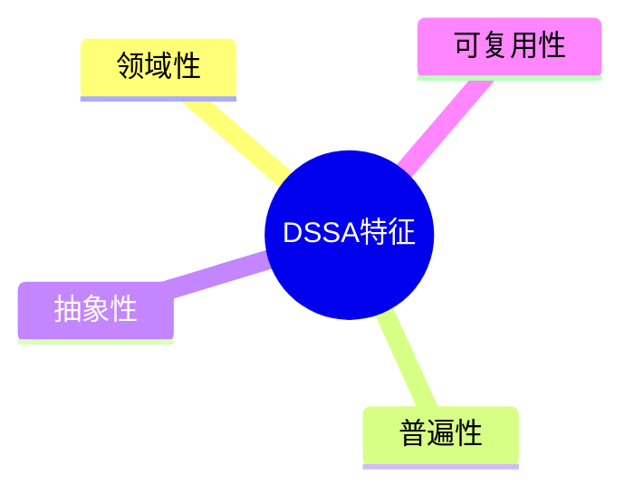

### DSSA 基本活动

| 活动 | 目的 | 产出 |
|-----|------|------|
| **领域分析** | 分析领域共性需求 | ==领域模型== |
| **领域设计** | 设计适应性架构 | ==DSSA== |
| **领域实现** | 获取可重用信息 | 可重用构件 |

### DSSA 三层模型

| 层次 | 主要工作者 |
|-----|-----------|
| 领域开发环境 | 领域专家 |
| 领域特定应用开发环境 | ==应用工程师== |
| 应用执行环境 | 最终用户 |

---

## 架构复用

### 复用类型

| 类型 | 说明 |
|-----|------|
| **机会复用** | 开发中发现可复用资产就复用 |
| **系统复用** | 开发前规划决定复用内容 |

### 可复用资产

需求、架构设计、元素、建模分析、测试、项目规划、过程方法工具、人员、样本系统、缺陷消除

!!! tip "复用趋势"

    复用体由 ==小粒度向大粒度== 发展

---

## 中间件技术

### 中间件定义

中间件是处于 ==操作系统和应用程序之间== 的软件，用于：

- 在不同技术之间共享资源
- 连接异构的网络环境
- 整合不同的操作系统和数据库

### 中间件五大类型

| 类型 | 说明 |
|-----|------|
| **数据库访问中间件** | 统一数据库访问接口 |
| **远程过程调用（RPC）** | 远程服务调用 |
| **面向消息中间件（MOM）** | 异步消息传递 |
| **分布式对象中间件** | 分布式对象管理 |
| **事务中间件** | 事务处理协调 |

---

## 典型应用架构

### J2EE 架构

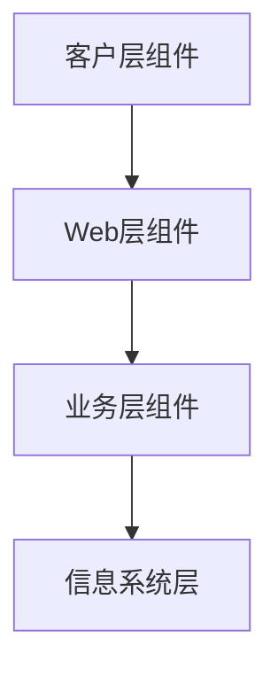

**典型技术栈**：JSP + Servlet + JavaBean + DAO

| 组件 | 作用 |
|-----|------|
| JSP | 视图层，显示和收集数据 |
| Servlet | 业务逻辑层，处理复杂业务 |
| JavaBean | 数据封装 |
| DAO | 数据库操作 |

### .NET 架构

.NET 框架处于操作系统和应用语言之间，==仅适用于微软系统==，而 J2EE 支持跨平台。

---

## 设计模式层次

!!! info "三个层次"

    | 层次 | 说明 | 示例 |
    |-----|------|------|
    | **架构模式** | 高层设计决策 | C/S 结构 |
    | **设计模式** | 与实现语言无关的设计 | 工厂模式、单例模式 |
    | **惯用法** | 特定语言的实现技巧 | C++ 引用计数 |

---

## 总结

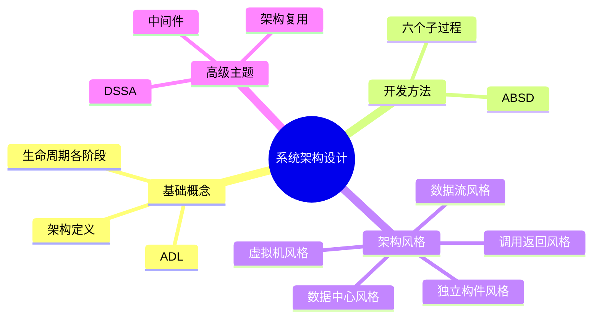

!!! note "学习建议"

    1. **架构风格**是核心考点，要能区分各风格的特点和适用场景
    2. **ABSD** 六个子过程要熟悉，特别是复审需要外部人员参与
    3. **质量属性**与架构风格的关系是常见考题
    4. 理解架构模式、设计模式、惯用法三个层次的区别
