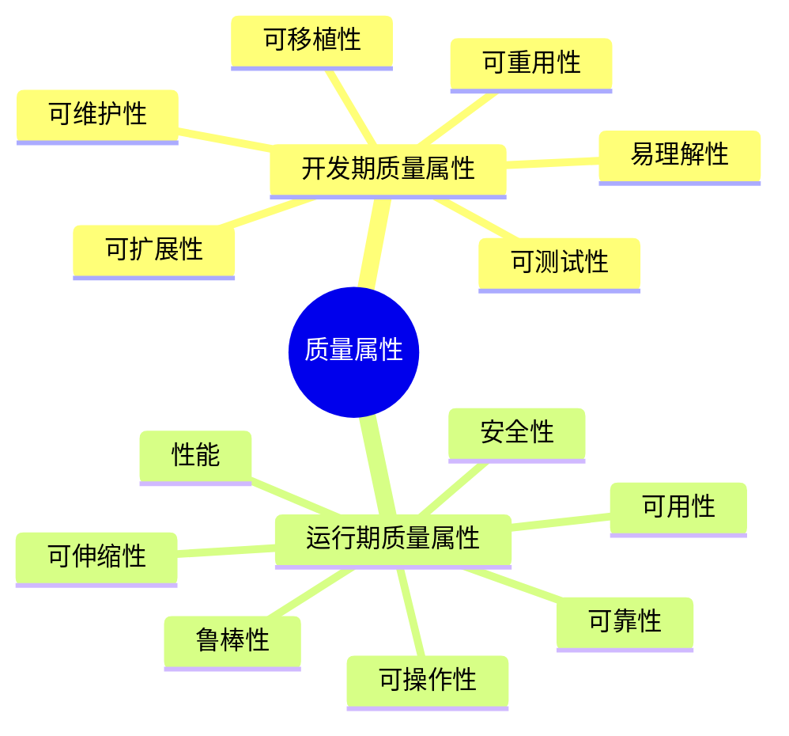
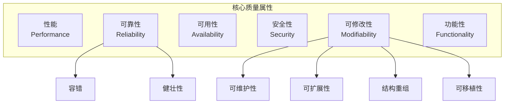
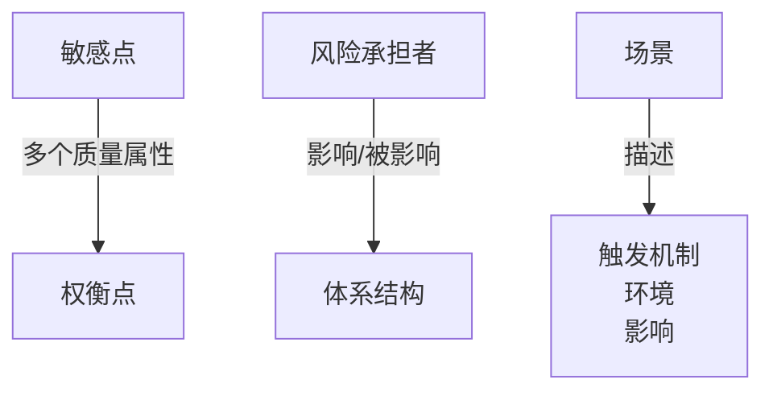
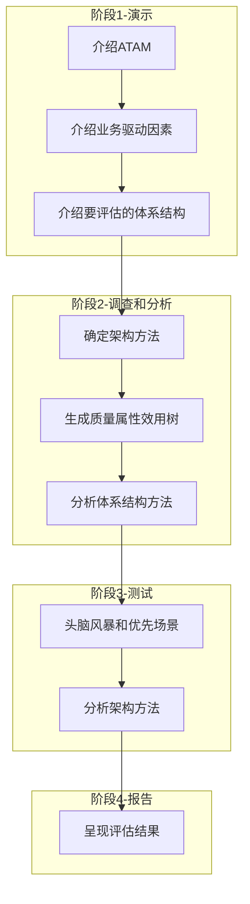
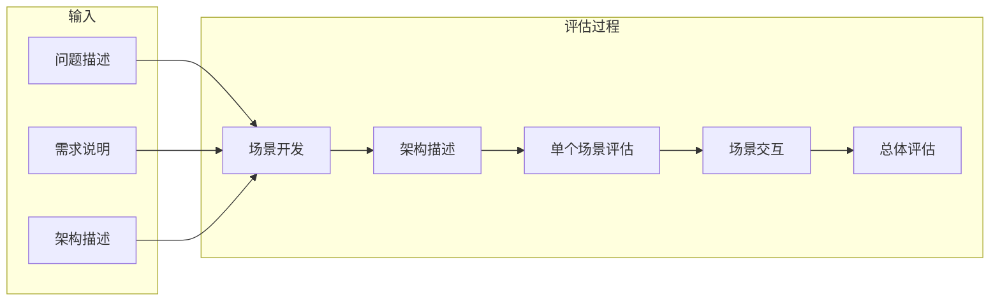

# 系统质量属性与架构评估

!!! abstract "本章导读"
    质量属性是衡量软件系统优劣的关键指标，架构评估则是验证架构设计是否满足质量要求的重要手段。本章详细介绍开发期和运行期质量属性、面向架构评估的六大质量属性（性能、可靠性、可用性、安全性、可修改性、功能性）及其设计策略，重点掌握 ATAM 和 SAAM 两种主流评估方法的流程与区别。

## 学习目标

- [ ] 理解开发期与运行期质量属性的分类
- [ ] 掌握面向架构评估的六大质量属性及其设计策略
- [ ] 熟练运用质量属性场景描述的六要素
- [ ] 理解敏感点、权衡点等关键概念
- [ ] 掌握 ATAM 四阶段评估流程
- [ ] 掌握 SAAM 评估方法的输入和过程
- [ ] 能够区分 ATAM 与 SAAM 的特点

---

## 软件系统质量属性

### 质量属性分类

软件系统质量属性是**可测量或可测试**的属性，基于软件生命周期分为两大类：



### 开发期质量属性

| 属性 | 定义 | 关注点 |
|------|------|-------|
| **易理解性** | 设计被开发人员理解的难易程度 | 代码可读性、文档完整性 |
| **可扩展性** | 因适应新需求而增加新功能的能力 | 也称**灵活性** |
| **可重用性** | 重用软件系统或某一部分的难易程度 | 组件化、模块化程度 |
| **可测试性** | 测试以证明满足需求规范的难易程度 | 可观察性、可控制性 |
| **可维护性** | 识别修改点并实施修改的难易程度 | 修复缺陷、增加功能、提高质量 |
| **可移植性** | 从一个运行环境转移到另一个的难易程度 | 平台无关性 |

### 运行期质量属性

| 属性 | 定义 | 关键指标 |
|------|------|---------|
| **性能** | 及时提供相关服务的能力 | 速度、吞吐量、容量 |
| **安全性** | 响应合法用户并阻止非授权使用的能力 | 认证、授权、加密 |
| **可伸缩性** | 用户数和数据量增加时维持高服务质量的能力 | 水平/垂直扩展能力 |
| **可操作性** | 与其他系统交换数据和调用服务的难易程度 | 也称**互操作性** |
| **可靠性** | 在一定时间内持续无故障运行的能力 | MTTF、MTBF |
| **可用性** | 系统在一定时间内正常工作的时间比例 | 通常用百分比表示 |
| **鲁棒性** | 非正常情况下仍正常运行的能力 | 也称**健壮性**或**容错性** |

---

## 面向架构评估的质量属性 ⭐

!!! warning "重要提示"
    面向架构评估的质量属性是考试重点，需要掌握每个属性的定义、设计策略。

### 六大核心质量属性



### 质量属性详解

| 属性 | 核心定义 | 设计策略 |
|------|---------|---------|
| **性能** | 处理任务所需时间或单位时间内的处理量 | 优先级队列、增加计算资源、减少计算开销、引入并发机制、资源调度 |
| **可靠性** | 出现错误后仍能保证系统正确运行 | 心跳、Ping/Echo、冗余、选举 |
| **可用性** | 系统正常运行的时间比例 | 心跳、Ping/Echo、冗余、选举 |
| **安全性** | 向合法用户提供服务并阻止非法用户的能力 | 入侵检测、用户认证、用户授权、追踪审计 |
| **可修改性** | 快速以较高性价比对系统进行变更的能力 | 信息隐藏、接口实现分离、运行时注册 |
| **功能性** | 需求满足程度 | 需求分析、功能设计 |

!!! tip "可靠性 vs 可用性"
    当题目同时出现可靠性和可用性选项时，**优先选择可用性**。
    
    - **可靠性**：强调系统不出故障
    - **可用性**：强调系统正常运行的时间占比

### 可修改性的四个子属性

| 子属性 | 说明 |
|-------|------|
| **可维护性** | 局部修复使故障对架构的负面影响最小化 |
| **可扩展性** | 因松散耦合更易实现新特性/功能，不影响架构 |
| **结构重组** | 不影响主体进行的灵活配置 |
| **可移植性** | 适用于多样的环境（硬件平台、语言、操作系统等） |

### 策略与质量属性对照表

| 设计策略 | 主要提高的质量属性 |
|---------|------------------|
| **Ping/Echo** | 可用性 |
| **心跳** | 可用性、可靠性 |
| **限制访问** | 安全性 |
| **运行时注册** | 可修改性 |
| **接口实现分离** | 可修改性 |
| **主动冗余** | 可靠性 |
| **队列调度** | 性能 |
| **信息隐藏** | 可修改性 |
| **记录回放** | 可测试性 |

---

## 质量属性场景描述

质量属性场景是面向特定质量属性的需求描述，由**六个部分**组成：


| 要素 | 定义 | 示例 |
|------|------|------|
| **刺激源** | 生成刺激的实体（人、计算机系统或其他刺激器） | 用户、外部系统、攻击者 |
| **刺激** | 刺激到达系统时需要考虑的条件 | 用户请求、系统故障、安全攻击 |
| **环境** | 刺激发生的条件（系统状态） | 正常运行、过载、启动中 |
| **制品** | 被激励的对象 | 整个系统或系统的某一部分 |
| **响应** | 激励到达后采取的行动 | 处理请求、记录日志、发出警报 |
| **响应度量** | 对响应进行度量的方式 | 响应时间、吞吐量、可用时间比例 |

!!! example "场景示例：可用性"
    - **刺激源**：系统内部
    - **刺激**：组件故障
    - **环境**：正常运行状态
    - **制品**：数据库服务
    - **响应**：自动切换到备用服务
    - **响应度量**：切换时间 < 3 秒，服务可用率 > 99.9%

---

## 系统架构评估

### 评估方法分类

| 方法类型 | 描述 | 特点 |
|---------|------|------|
| **基于调查问卷或检查表** | 通过问卷收集评估信息 | 很大程度依赖评估人员的**主观判断** |
| **基于场景的评估方法** | 通过构建场景评估架构 | ATAM、SAAM 采用此方法 |
| **基于度量的评估方法** | 建立质量属性和度量的映射 | 从软件文档获取度量信息 |

### 关键概念



| 概念 | 定义 |
|------|------|
| **敏感点** | 实现质量目标时应注意的点，是一个或多个构件的特性 |
| **权衡点** | 影响多个质量属性的敏感点 |
| **风险承担者** | 影响体系结构或被体系结构影响的群体（利益相关人） |
| **场景** | 确定架构质量评估目标的交互机制 |

!!! example "权衡点示例"
    "改变加密的级别可能会对安全性和性能都产生显著的影响"
    
    这是一个典型的**权衡点**描述：
    
    - 提高加密级别 → 安全性↑，性能↓
    - 降低加密级别 → 安全性↓，性能↑

---

## ATAM：架构权衡分析法 ⭐

!!! info "ATAM 概述"
    ATAM（Architecture Tradeoff Analysis Method）是一种架构评估方法，主要在系统开发之前，针对**性能、可用性、安全性、可修改性**等质量属性进行评价和折中。

### ATAM 四阶段流程



### 阶段详解

=== "阶段 1：演示（Presentation）"
    **目标**：让所有参与者了解评估背景
    
    | 步骤 | 内容 |
    |------|------|
    | 1. 介绍 ATAM | 描述 ATAM 评估过程 |
    | 2. 介绍业务驱动因素 | 业务视角：系统功能、主要利益相关方、业务目标、限制 |
    | 3. 介绍要评估的体系结构 | 架构可用性及质量要求 |

=== "阶段 2：调查和分析"
    **目标**：深入分析架构的关键问题
    
    | 步骤 | 内容 |
    |------|------|
    | 1. 确定架构方法 | 识别满足关键需求的架构方法 |
    | 2. 生成质量属性效用树 | 确定最重要的质量属性并排序 |
    | 3. 分析体系结构方法 | 找出风险、非风险、敏感点、权衡点 |
    
    **分析过程**：
    
    ```
    调查架构方法 → 创建分析问题 → 分析问题答案 → 找出风险/敏感点/权衡点
    ```

=== "阶段 3：测试"
    **目标**：验证架构分析结果
    
    | 步骤 | 内容 |
    |------|------|
    | 1. 头脑风暴和优先场景 | 与效用树中的优先方案比较 |
    | 2. 分析架构方法 | 进一步验证分析结果 |

=== "阶段 4：报告"
    **目标**：汇总并呈现评估结果
    
    提供评估期间收集的所有信息，呈现给利益相关者。

### ATAM 核心特点

- 强调对**质量属性**进行分析、分类和优先级排序
- 构建**质量属性效用树**
- 识别和分析**风险点、非风险点、敏感点、权衡点**

---

## SAAM：软件架构分析方法

!!! info "SAAM 概述"
    SAAM（Software Architecture Analysis Method）是一种非功能质量属性的架构分析方法，是**最早形成文档并得到广泛应用**的软件架构分析方法。

### SAAM 的输入与过程



### SAAM 五步评估过程

| 步骤 | 内容 |
|------|------|
| **场景开发** | 开发评估场景 |
| **架构描述** | 描述被评估的架构 |
| **单个场景评估** | 评估每个场景 |
| **场景交互** | 分析场景之间的交互影响 |
| **总体评估** | 综合评估整体架构 |

---

## ATAM vs SAAM 对比

| 对比项 | SAAM | ATAM |
|-------|------|------|
| **特定目标** | 验证架构，发现潜在问题<br>可用于单系统评估或多系统比较 | 确定在多个质量属性之间折中的必要性 |
| **评估技术** | 场景技术 | 场景技术 + 启发式分析方法 |
| **质量属性** | **可修改性**是主要分析内容 | 性能、可用性、安全性、可修改性 |
| **风险承担者** | 所有参与者 | 场景和需求收集过程中的相关人 |
| **架构描述** | 围绕功能、结构和分配描述 | 五个基本结构及其映射关系 |
| **方法活动** | 场景开发→架构描述→单场景评估→场景交互→总体评估 | 场景/需求收集→架构视图/场景实现→属性模型构造/分析→折中 |
| **知识库复用** | 不涉及 | 有基于属性的体系模型，**可复用** |
| **应用领域** | 空中交通管制、嵌入式音频、修正控制系统 | 仍处于研究中 |

!!! tip "记忆技巧"
    - **SAAM**：侧重**可修改性**，评估**单一质量属性**
    - **ATAM**：侧重**权衡分析**，评估**多个质量属性**的折中

---

## 其他评估方法

### 成本效益分析法（CBAM）

CBAM 评估流程：


### 其他方法简介

| 方法 | 特点 |
|------|------|
| **SAEM** | 从外部和内部质量属性阐述评估模型 |
| **SAABNet** | 辅助架构定性评估，基于贝叶斯网络 |
| **SACMM** | 软件架构修改的度量方法，计算架构间距离 |
| **SASAM** | 通过预期架构和实际架构的比较进行静态评估 |
| **ALRRA** | 软件架构可靠性风险评估方法 |
| **AHP** | 把定性分析和定量计算相结合 |
| **COSMIC+UML** | 采用统一的 COSMIC 方法进行度量 |

---

## 本章小结

### 核心知识点

1. **质量属性分类**：开发期（6 个）vs 运行期（7 个）
2. **架构评估质量属性**：性能、可靠性、可用性、安全性、可修改性、功能性
3. **场景六要素**：刺激源、刺激、环境、制品、响应、响应度量
4. **关键概念**：敏感点（单属性）、权衡点（多属性）
5. **ATAM**：四阶段（演示→调查分析→测试→报告），构建效用树
6. **SAAM**：五步骤（场景开发→架构描述→单场景评估→场景交互→总体评估）

### 重要对照表

| 设计策略 | 质量属性 |
|---------|---------|
| Ping/Echo、心跳、冗余、选举 | 可用性、可靠性 |
| 入侵检测、用户认证、用户授权、追踪审计 | 安全性 |
| 信息隐藏、接口实现分离、运行时注册 | 可修改性 |
| 队列调度、增加资源、并发机制 | 性能 |
| 记录回放 | 可测试性 |

### 考试重点

| 知识点 | 考查形式 |
|-------|---------|
| 质量属性与设计策略对应 | 给出策略判断提高哪个属性 |
| 敏感点与权衡点区分 | 根据描述判断是敏感点还是权衡点 |
| ATAM 四阶段流程 | 流程排序或阶段内容识别 |
| SAAM vs ATAM | 两种方法的特点对比 |

### 学习建议

1. **质量属性**：牢记设计策略与质量属性的对应关系
2. **场景六要素**：结合实际案例理解每个要素的含义
3. **评估方法**：重点掌握 ATAM 的四阶段和 SAAM 的五步骤
4. **概念区分**：理解敏感点和权衡点的区别
