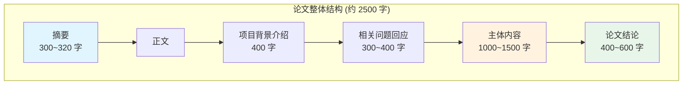
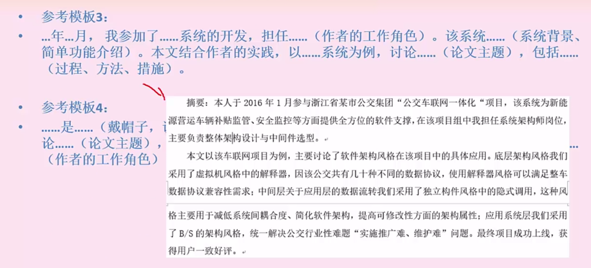
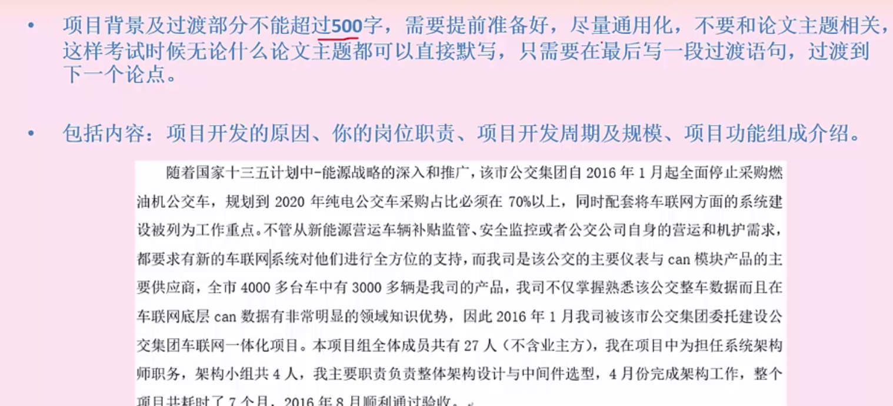
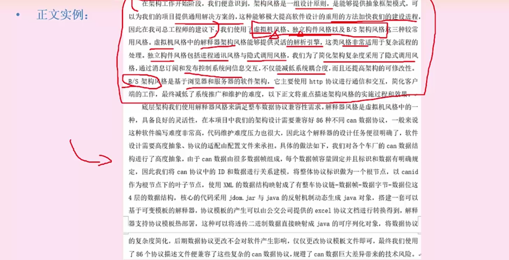
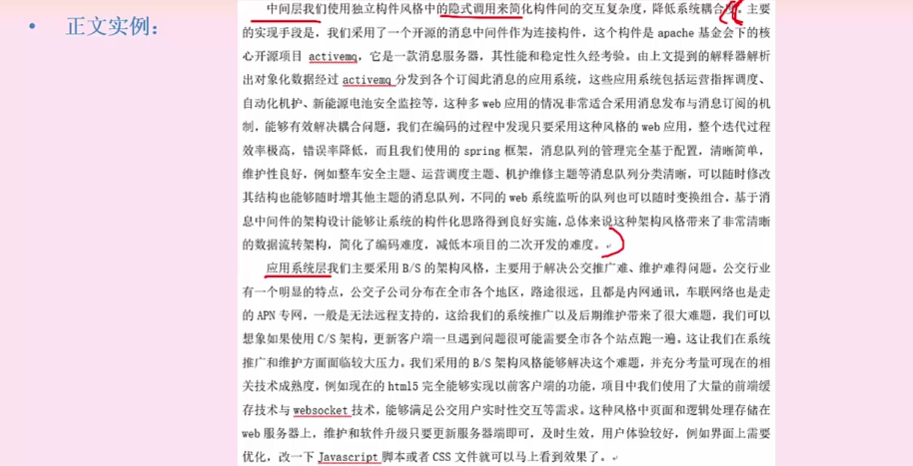
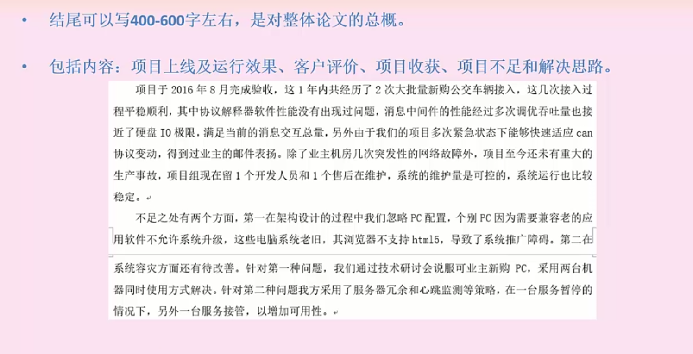
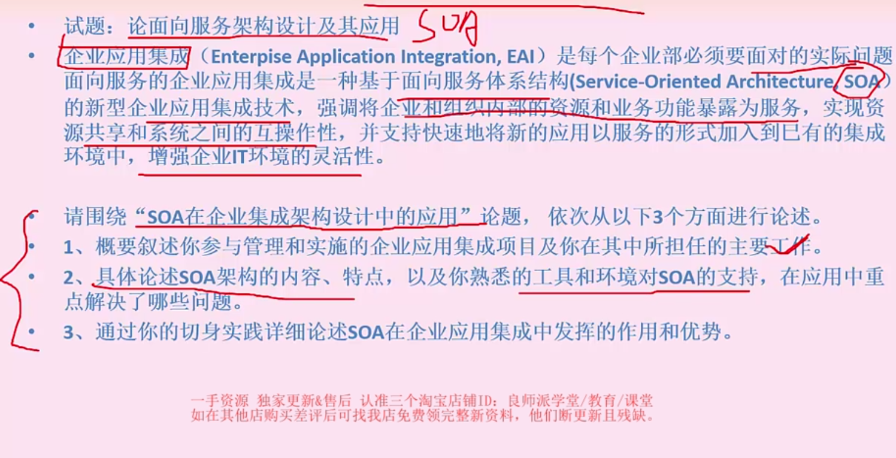

# 论文写作

!!! abstract "本章导读"
    论文是软考高级考试的重要组成部分，占 75 分。与选择题和案例分析不同，论文考查的是考生将理论知识与实践经验相结合的综合能力。本章将系统讲解论文写作的方法论，帮助你建立可复用的写作框架。

    **学习目标**：

    - 掌握论文的基本框架和字数分配
    - 学会构建可复用的摘要、背景、结论模板
    - 理解正文写作的"一总三分"结构
    - 熟悉常见论文主题的应对策略

---

## 一、写作原则

成功的论文写作需要遵循以下核心原则：

### 1.1 准备策略

| 原则 | 说明 | 常见误区 |
|------|------|----------|
| **不要猜题** | 复用构建（摘要+项目背景+结尾），而非整篇复用 | 押题失败导致无话可写 |
| **不要抄范文** | 只能改范文，选择适合自己的范文进行修改 | 原封不动照抄被判雷同 |
| **选好项目** | 必须是近三年内的中大型商业项目 | 虚构项目细节经不起推敲 |
| **补齐知识** | 发现不会的知识点一定要全部背会 | 理论部分答非所问 |

### 1.2 写作技巧

!!! tip "写作要点"
    1. **勇于迈出第一步**：万事开头难，写完第一篇就不难了，第一篇论文不限时间
    2. **字数控制**：一般在 300（摘要）+ 2200（正文）左右，写到最后一页上面
    3. **字迹工整**：字迹一定要完整，一笔一划，保持卷面整洁
    4. **站位正确**：从系统架构师的角度看项目，技术细节要少且精
    5. **理论联系实际**：书本理论要与实际的项目联系起来

### 1.3 行文规范

- **避免口语化**：使用正式的书面语言
- **段落适中**：文档段落不宜太长，保持阅读节奏
- **列举有度**：不要全局都列举，可以局部段落列举
- **论点分离**：论点分开论述，没必要都写编号
- **回答自然**：写正文时不要生硬回答问题，要组合成通顺的文章

---

## 二、论文框架

!!! info "字数分配原则"
    **摘要 300 字 + 项目背景 400 字 + 论文总结 400~600 字 = 提前准备 1200 字**
    
    这 1200 字是可复用的"模板"，只需准备一次，每次考试稍作调整即可。

### 2.1 整体结构



### 2.2 各部分详解

| 部分 | 内容要点 | 字数 |
|------|----------|------|
| **摘要** | 项目背景及主要功能、你的岗位及主要职责、论文主体内容的总概、项目实施效果或总结感悟 | 300~320 |
| **项目背景** | 项目背景详细介绍、开发原因、开始时间、实施周期、你的岗位职责 | 400 左右 |
| **问题回应** | 非核心论点问题的回应、引出主体内容（核心论点） | 300~400 |
| **主体内容** | 采用"一总三分"模式，分四个段落描述核心论点 | 1000~1500 |
| **论文结论** | 项目运行效果、总结项目不足、提出解决思路 | 400~600 |

---

## 三、模板详解

### 3.1 摘要模板

摘要是论文的"门面"，需要在 300 字内概括全文。

!!! example "摘要结构图示"
    

=== "模板一（标准型）"

    > 本文讨论了 **______** 系统的 **______**（论文主题）。该系统 **______**（系统背景、简单功能介绍）。在本文中，首先讨论了 **______**（过程、方法、措施），最后 **______**（不足之处/如何改进、特色之处）。在本系统的开发过程中，我担任 **______**（作者的工作角色）。

=== "模板二（详细型）"

    > 根据 **______** 需求（项目背景），我所在的 **______** 组织了 **______** 系统的开发。在系统 **______**（系统背景、简单功能介绍）。在该系统的开发中，我担任了 **______**（作者的工作角色）。我通过采取 **______**（过程、方法、措施），使该系统开发工作圆满完成，得到了用户们的一致好评。但现在看来，**______**（不足之处/如何改进、特色之处）。

=== "模板三（时间型）"

    > **______** 年 **______** 月，我参加了 **______** 系统的开发，担任 **______**（作者的工作角色）。该系统 **______**（系统背景、简单功能介绍）。本文结合作者的实践，以 **______** 系统为例，讨论 **______**（论文主题），包括 **______**（过程、方法、措施）。

### 3.2 项目背景模板

项目背景是对摘要的展开，需要详细介绍项目的来龙去脉。

!!! example "项目背景结构图示"
    

**项目背景应包含**：

1. **项目来源**：为什么要做这个项目
2. **项目概述**：项目的主要功能和规模
3. **时间信息**：项目开始时间、持续周期
4. **角色定位**：你在项目中的角色和职责
5. **技术选型**：采用的主要技术栈（简述）

### 3.3 正文写作

正文是论文的核心，约 1500 字，主要回应论文题目的要求。

!!! warning "正文结构要点"
    论文题目一般有两个小问：
    
    - **第一问（非核心论点）**：考察理论知识，要求介绍某项技术原理，约 300~400 字
    - **第二问（核心论点）**：考察项目经验，要求结合实际说明理论如何应用，约 1200 字

#### 非核心论点回应



#### 核心论点写作（"一总三分"模式）

核心论点采用**总分式描述**：

```
├── 总述：概括你在项目中如何应用该技术（1 段）
├── 分述一：第一个应用场景/方法/措施（1 段）
├── 分述二：第二个应用场景/方法/措施（1 段）
└── 分述三：第三个应用场景/方法/措施（1 段）
```



### 3.4 结论模板

结论是对全文的总结，约 400~600 字。

!!! example "结论结构图示"
    

!!! tip "结论写作建议"
    建议分两段描述：
    
    1. **第一段**：项目上线及运行效果、客户评价、项目收获
    2. **第二段**：项目不足和解决思路

**结论包含的内容**：

| 内容 | 说明 |
|------|------|
| 项目上线及运行效果 | 系统何时上线，运行是否稳定 |
| 客户评价 | 用户反馈，一般写正面评价 |
| 项目收获 | 技术成长、团队协作等方面的收获 |
| 项目不足 | 客观分析存在的问题（体现反思能力） |
| 解决思路 | 针对不足提出改进方案（体现规划能力） |

---

## 四、常见论文主题

以下是软考架构师论文的常见主题，建议针对每个主题准备核心论点：

| 序号 | 论文主题 | 核心考点 |
|------|----------|----------|
| 1 | 论软件系统架构风格 | 架构风格分类、选型依据、实践应用 |
| 2 | 论面向服务架构设计及应用 | SOA 原则、服务设计、ESB 应用 |
| 3 | 论软件多层架构设计 | 分层原则、各层职责、层间通信 |
| 4 | 论信息系统的安全性与保密性设计 | 安全需求分析、安全架构、加密技术 |
| 5 | 论高可靠性软件中软件容错技术的应用 | 容错策略、冗余设计、故障恢复 |
| 6 | 论基于构件的软件开发 | 构件模型、复用策略、组装技术 |
| 7 | 论软件设计模式及其应用 | 设计模式分类、选型原则、实践案例 |
| 8 | 论企业集成平台的技术与应用 | EAI 架构、集成模式、中间件选型 |
| 9 | 论软件项目管理技术及其应用 | 项目计划、风险管理、质量控制 |

!!! example "范文参考：论面向服务架构设计及应用"
    

---

## 五、备考建议


### 5.1 备考步骤

1. **选定项目**（考前 2 个月）
    - 选择近三年内参与的中大型商业项目
    - 整理项目背景、技术栈、个人职责等信息

2. **准备模板**（考前 1.5 个月）
    - 编写摘要模板（可复用）
    - 编写项目背景模板（可复用）
    - 编写结论模板（可复用）

3. **背诵理论**（考前 1 个月）
    - 针对常见论文主题背诵核心理论
    - 重点掌握架构风格、设计模式、SOA、安全等

4. **练习写作**（考前 2 周）
    - 每周至少写 2 篇完整论文
    - 控制时间，培养手感

5. **模拟考试**（考前 1 周）
    - 按照考试时间要求完成论文
    - 练习字迹工整和时间分配

### 5.2 常见问题

!!! warning "高频考点"
    **问题**：论文写作时间不够怎么办？
    
    **答案**：
    
    1. 提前准备好摘要、项目背景、结论模板（约 1200 字），考试时只需写 1300 字正文
    2. 练习时严格控制时间，培养写作速度
    3. 列提纲后再写，避免边想边写浪费时间

---

## 六、总结

论文写作的关键在于**充分准备**和**灵活应用**：

| 要点 | 说明 |
|------|------|
| **模板复用** | 摘要、背景、结论可复用，减少考场压力 |
| **理论储备** | 熟练掌握常见论文主题的核心理论 |
| **实践结合** | 将理论与自己的项目经验有机结合 |
| **格式规范** | 字迹工整、段落清晰、字数适当 |

!!! quote "写作心得"
    论文不是考你的文采，而是考你的**专业能力**和**实践经验**。把理论讲清楚，把项目写真实，把思考写深入，论文自然能得高分。
